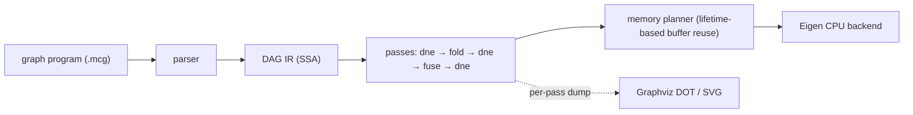

# minicompiler

[](https://github.com/kartsen03/minicompiler/actions/workflows/ci.yml)

A small compiler for ML compute graphs, written in C++17. It reads a graph
program, builds a DAG intermediate representation, optimizes it with
dead-node elimination, constant folding and elementwise operator fusion,
plans buffer reuse from value lifetimes, and executes the result on an
Eigen-based CPU backend.



## Quick start

Requires CMake 3.20+ and a C++17 compiler. Eigen and GoogleTest are taken from
the system if installed (`apt install libeigen3-dev libgtest-dev`) and
downloaded at a pinned version otherwise.

```bash
cmake -S . -B build -DCMAKE_BUILD_TYPE=Release
cmake --build build -j
ctest --test-dir build --output-on-failure
```

Compile and run a graph with the `mcc` driver:

```bash
build/tools/mcc bench/graphs/mlp_block.mcg --stats            # node counts after each pass
build/tools/mcc bench/graphs/gelu_chain.mcg --dim M=2 --print  # the optimized IR
build/tools/mcc bench/graphs/mlp_block.mcg --run               # run on seeded random inputs
build/tools/mcc bench/graphs/mlp_block.mcg --dump-dot out/     # one DOT file per stage
build/tools/mcc bench/graphs/gelu_chain.mcg --bench            # timing as JSON
```

## How it works

**Graphs as programs.** A `.mcg` file declares inputs, constants (literal or
seeded random) and one op per line in SSA form; named dims can be overridden
from the command line. The format and its error messages are in
[`include/minicompiler/parser.hpp`](include/minicompiler/parser.hpp).

```
input x : f32[B, 512]
const w : f32[512, 2048] = uniform(seed=11, lo=-0.044, hi=0.044)
h = matmul x, w
y = relu h
output y
```

**DAG IR.** Nodes live in a vector and name their operands by index. An
operand must exist before a node can use it, so the node order is always
topological and cycles cannot be built. Passes never mutate a graph; each
builds a new one, and `Graph::verify()` re-checks every invariant (operand
order, arity, inferred types, constant sizes) after every pass.
([`graph.hpp`](include/minicompiler/graph.hpp))

**Passes** ([`include/minicompiler/passes/`](include/minicompiler/passes)):

- *Dead-node elimination*: mark and sweep from the outputs. One backward walk
  suffices because users always follow their operands.
- *Constant folding*: evaluates nodes whose operands are all constants, with
  the CPU backend's own kernels, in topological order, so whole constant
  subexpressions such as GELU's `sqrt(2/pi)` or BatchNorm's
  `sqrt(var + eps)` fold in one pass.
- *Operator fusion*: grows groups of elementwise ops from each root toward
  its producers. A producer joins when it has the root's shape, is not a
  graph output, and all of its users are already in the group. That last
  rule keeps groups convex, so fusing cannot create a cycle through an
  outside node such as a matmul. Each group becomes one `FusedElementwise`
  node holding a small per-element program, with scalar constants baked in.

**CPU backend.** Unfused ops run as vectorized Eigen expressions and matmul
uses Eigen's GEMM. A fused kernel runs its program block by block (512
elements), so intermediates stay in cache-resident 2 KB buffers instead of
making a round trip through memory for every op. Intermediate buffers are
assigned by a lifetime-based planner and reused, and graph outputs are
written straight into the caller's tensors.

## The IR before and after optimization

The MLP block (Linear → BatchNorm → GELU → Linear + residual) goes from 37
nodes and 22 compute ops to 13 nodes and 4 compute nodes: two matmuls, a
14-op BatchNorm+GELU kernel and a 2-op bias+residual kernel.
Every stage of every benchmark graph is in [`docs/ir_diagrams/`](docs/ir_diagrams).

| Input | After all passes |
|---|---|
|  |  |

## Results: what the passes buy on the CPU

The same graphs with no passes and with the full pipeline, on the Eigen
backend, single-threaded (`bench/bench_cpu.cpp`):

<!-- BEGIN cpu-passes -->
<!-- END cpu-passes -->

Fusion helps most when a chain of cheap elementwise ops streams tensors
larger than the caches: the unfused GELU chain spends 88% of its time in
memory-bound add/mul kernels. At 16 KB everything fits in cache, so there is
no traffic to save, and the block interpreter's dispatch overhead makes the
fused version slightly slower. In the matmul-heavy graphs Eigen's GEMM takes
about 90% of the time, which caps what fusion can do. The `dne`-only variant
computes an identical graph and measures 0.96–1.01x, which bounds the noise.
Profiles and analysis are in [`docs/profiling/`](docs/profiling).

### Against PyTorch (CPU)

<!-- BEGIN cpu-torch -->
<!-- END cpu-torch -->

## Testing

GoogleTest suites ([`tests/`](tests)) cover each component and each pass's
behavior, compare every kernel against a double-precision reference with
stated tolerances, and check on random graphs that optimized and unoptimized
graphs agree. The random-graph generator tracks interval bounds so it only
builds numerically meaningful graphs. CI builds and tests on Ubuntu with GCC,
Clang, and GCC under AddressSanitizer and UndefinedBehaviorSanitizer.

## Layout

```
include/minicompiler/   public headers: IR, parser, passes, DOT export, runtime
src/                    implementation; src/cpu/ is the Eigen backend
tools/mcc.cpp           command-line driver
tests/                  GoogleTest suites
bench/                  benchmark graphs (.mcg), CPU benchmark, PyTorch harness
scripts/                diagram rendering, profiling, benchmark recording
docs/                   IR diagrams and profiling results
results/                recorded benchmark results (JSON)
```

## License

MIT. See [LICENSE](LICENSE).
