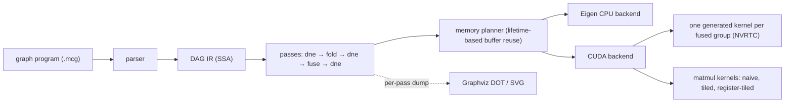

# minicompiler

[](https://github.com/kartsen03/minicompiler/actions/workflows/ci.yml)

A small compiler for ML compute graphs, written in C++17. It reads a graph
program, builds a DAG intermediate representation, optimizes it with
dead-node elimination, constant folding and elementwise operator fusion,
plans buffer reuse from value lifetimes, and executes the result on an
Eigen-based CPU backend or a CUDA backend that generates one kernel per
fused group.



## Quick start

Requires CMake 3.20+ and a C++17 compiler. Eigen and GoogleTest are taken from
the system if installed (`apt install libeigen3-dev libgtest-dev`) and
downloaded at a pinned version otherwise.

```bash
cmake -S . -B build -DCMAKE_BUILD_TYPE=Release
cmake --build build -j
ctest --test-dir build --output-on-failure
```

Compile and run a graph with the `mcc` driver:

```bash
build/tools/mcc bench/graphs/mlp_block.mcg --stats            # node counts after each pass
build/tools/mcc bench/graphs/gelu_chain.mcg --dim M=2 --print  # the optimized IR
build/tools/mcc bench/graphs/mlp_block.mcg --run               # run on seeded random inputs
build/tools/mcc bench/graphs/mlp_block.mcg --dump-dot out/     # one DOT file per stage
build/tools/mcc bench/graphs/gelu_chain.mcg --bench            # timing as JSON
```

### With the CUDA backend

If CMake finds a CUDA toolkit, the CUDA backend is built too (the configure
step says which); without one, or with `-DMINICOMPILER_ENABLE_CUDA=OFF`, the
build is CPU-only. CI builds it with CUDA 12.6 and 13.4; the results below
were measured with 13.1. The matmul kernels are compiled ahead of time for the
local GPU (`CMAKE_CUDA_ARCHITECTURES=native` by default with CMake 3.24 or
newer, otherwise sm_75 and sm_86); the elementwise and fused kernels are
generated and compiled at run time by NVRTC for whatever GPU is present.

```bash
build/tools/mcc bench/graphs/mlp_block.mcg --backend cuda --run   # run on the GPU
build/tools/mcc bench/graphs/gelu_chain.mcg --emit-cuda           # the generated CUDA source
```

To rebuild and re-measure everything on a Colab GPU, see
[Reproducing the GPU results on Colab](#reproducing-the-gpu-results-on-colab).

## How it works

**Graphs as programs.** A `.mcg` file declares inputs, constants (literal or
seeded random) and one op per line in SSA form; named dims can be overridden
from the command line. The format and its error messages are in
[`include/minicompiler/parser.hpp`](include/minicompiler/parser.hpp).

```
input x : f32[B, 512]
const w : f32[512, 2048] = uniform(seed=11, lo=-0.044, hi=0.044)
h = matmul x, w
y = relu h
output y
```

**DAG IR.** Nodes live in a vector and name their operands by index. An
operand must exist before a node can use it, so the node order is always
topological and cycles cannot be built. Passes never mutate a graph; each
builds a new one, and `Graph::verify()` re-checks every invariant (operand
order, arity, inferred types, constant sizes) after every pass.
([`graph.hpp`](include/minicompiler/graph.hpp))

**Passes** ([`include/minicompiler/passes/`](include/minicompiler/passes)):

- *Dead-node elimination*: mark and sweep from the outputs. One backward walk
  suffices because users always follow their operands.
- *Constant folding*: evaluates nodes whose operands are all constants, with
  the CPU backend's own kernels, in topological order, so whole constant
  subexpressions such as GELU's `sqrt(2/pi)` or BatchNorm's
  `sqrt(var + eps)` fold in one pass.
- *Operator fusion*: grows groups of elementwise ops from each root toward
  its producers. A producer joins when it has the root's shape, is not a
  graph output, and all of its users are already in the group. That last
  rule keeps groups convex, so fusing cannot create a cycle through an
  outside node such as a matmul. Each group becomes one `FusedElementwise`
  node holding a small per-element program, with scalar constants baked in.

**CPU backend.** Unfused ops run as vectorized Eigen expressions and matmul
uses Eigen's GEMM. A fused kernel runs its program block by block (512
elements), so intermediates stay in cache-resident 2 KB buffers instead of
making a round trip through memory for every op. Intermediate buffers are
assigned by a lifetime-based planner and reused, and graph outputs are
written straight into the caller's tensors.

**CUDA backend** ([`src/cuda/`](src/cuda)). Every elementwise op or fused
group becomes one kernel. The generator turns the group's per-element program
into CUDA C++ with the shapes baked in: broadcast index math uses constant
divisors, scalar operands are hoisted out of the loop, constants are emitted
as exact bit patterns, and the kernel uses `float4` loads and stores when
every input's layout allows it. NVRTC compiles the source straight to a cubin
for the GPU's exact architecture, a process-wide cache keeps each kernel
compiled once, and the launch is a grid-stride loop sized to one wave of
resident blocks. Matmuls run hand-written kernels: naive (one thread per
output), shared-memory tiled (32×32), and register-tiled, which comes in two
sizes: 128×128 tiles with an 8×8 block of outputs per thread, or 64×64 tiles
with 4×4 per thread when the 128×128 tiles would keep at most three quarters
of the SMs busy. Device memory follows the same lifetime plan as on the CPU:
intermediates and outputs share reused buffers, inputs and constants get
their own (constants are uploaded once, at compile time), and a run copies
only the inputs in and the outputs out. `CudaExecutable::enqueue(stream)`
launches the kernels alone, on any stream, which is what the benchmarks time.

## The IR before and after optimization

The MLP block (Linear → BatchNorm → GELU → Linear + residual) goes from 37
nodes and 22 compute ops to 13 nodes and 4 compute nodes: two matmuls, a
14-op BatchNorm+GELU kernel and a 2-op bias+residual kernel.
Every stage of every benchmark graph is in [`docs/ir_diagrams/`](docs/ir_diagrams).

| Input | After all passes |
|---|---|
|  |  |

## Results: what the passes buy on the CPU

The same graphs with no passes and with the full pipeline, on the Eigen
backend, single-threaded (`bench/bench_cpu.cpp`):

<!-- BEGIN cpu-passes -->
| Graph | Size | Nodes | Compute nodes | Passes off | Passes on | Speedup (range over runs) |
|---|---|---:|---:|---:|---:|---:|
| `gelu_chain` | 1x4096 (16 KB) | 17 → 2 | 11 → 1 | 0.0065 ms | 0.0063 ms | 1.06x (1.05–1.28) |
| `gelu_chain` | 64x4096 (1 MB) | 17 → 2 | 11 → 1 | 1.10 ms | 0.469 ms | 2.34x (2.32–2.36) |
| `gelu_chain` | 256x4096 (4 MB) | 17 → 2 | 11 → 1 | 5.78 ms | 2.30 ms | 2.49x (2.45–2.54) |
| `gelu_chain` | 2048x4096 (32 MB) | 17 → 2 | 11 → 1 | 54.8 ms | 18.8 ms | 2.91x (2.88–3.35) |
| `matmul_bias_relu` | 64x1024 @ 1024x1024 | 6 → 5 | 3 → 2 | 3.55 ms | 3.56 ms | 1.00x (0.99–1.01) |
| `matmul_bias_relu` | 256x1024 @ 1024x1024 | 6 → 5 | 3 → 2 | 6.60 ms | 6.53 ms | 1.01x (1.01–1.01) |
| `mlp_block` | B=32, 512->2048->512 | 37 → 13 | 22 → 4 | 2.45 ms | 2.43 ms | 1.01x (1.01–1.01) |
| `mlp_block` | B=128, 512->2048->512 | 37 → 13 | 22 → 4 | 7.94 ms | 7.50 ms | 1.06x (1.05–1.06) |
| `mlp_block` | B=512, 512->2048->512 | 37 → 13 | 22 → 4 | 31.4 ms | 28.1 ms | 1.11x (1.10–1.11) |

Each of 3 runs times the variants in interleaved rounds; a run's speedup is the median over rounds of (passes-off time / passes-on time) within a round. The table shows the median across runs, the range across runs, and median times. Measured on CPU: 12th Gen Intel(R) Core(TM) i7-12700H, OS: Ubuntu 24.04.4 LTS, kernel 6.6.114.1-microsoft-standard-WSL2, compiler: gcc 13.3.0, Eigen 3.4.0, build: Release, march_native=ON, threads: 1 (Eigen without OpenMP), Windows power plan: Silent, commit d2c5bf6. Raw runs and the per-pass ablation: `results/cpu/`.
<!-- END cpu-passes -->

Fusion helps most when a chain of cheap elementwise ops streams tensors
larger than the caches: the unfused GELU chain spends 88% of its time in
memory-bound add/mul kernels. At 16 KB everything fits in cache, so there is
little traffic to save, and a run takes 4 µs. In the matmul-heavy graphs
Eigen's GEMM takes about 90% of the time, which caps what fusion can do.
Constant folding on its own (`dne+fold` in `results/cpu/passes.json`)
measures 0.99–1.03x: it only removes scalar arithmetic, so on the CPU its
effect is on node counts, not latency. The `dne`-only variant computes an
identical graph and stays within 0.98–1.03x for every size except the 16 KB
one (up to 1.18x), which bounds the noise. Profiles and analysis are in
[`docs/profiling/`](docs/profiling).

**Measuring on a laptop.** A pinned core's speed here drifts by up to 2x
within a minute (Windows moves the WSL virtual CPU between the i7's P- and
E-cores, and the "Silent" power plan caps power), so absolute times vary
between recordings. Every comparison is therefore timed in interleaved rounds
within one process, reported as the median of per-round ratios, and repeated
in three runs minutes apart; tables show the median across runs and the
range.

### Against PyTorch (CPU)

The same graphs, shapes, seeded weights and inputs, single-threaded on both
sides, all four variants timed interleaved in one Python process
([`bench/torch_compare.py`](bench/torch_compare.py)). minicompiler is called
in place on the NumPy arrays through a small C interface. "Eager (same ops)"
runs the graph op by op exactly as written; "eager (idiomatic)" is what a
PyTorch user would write, using PyTorch's fused library ops
(`F.gelu(approximate="tanh")`, `addmm`, `F.batch_norm`); `torch.compile` is
Inductor compiling the op-by-op function. Every PyTorch output matches
minicompiler's to within 5.4e-7 of the output's largest magnitude.

<!-- BEGIN cpu-torch -->
| Graph | Size | minicompiler | PyTorch eager (same ops) | PyTorch eager (idiomatic) | torch.compile |
|---|---|---:|---:|---:|---:|
| `gelu_chain` | 1x4096 (16 KB) | 0.015 ms | 0.063 ms, 3.99x (3.85–4.44) | 0.034 ms, 2.35x (2.19–2.49) | 0.137 ms, 8.46x (8.19–9.09) |
| `gelu_chain` | 64x4096 (1 MB) | 0.671 ms | 7.08 ms, 10.57x (10.52–10.63) | 1.86 ms, 2.73x (2.71–3.00) | 2.47 ms, 3.64x (3.61–3.83) |
| `gelu_chain` | 256x4096 (4 MB) | 2.68 ms | 28.3 ms, 10.53x (10.53–11.41) | 7.79 ms, 2.81x (2.72–2.98) | 9.04 ms, 3.29x (3.21–3.37) |
| `gelu_chain` | 2048x4096 (32 MB) | 19.2 ms | 222 ms, 11.61x (11.34–11.74) | 73.1 ms, 3.87x (3.77–3.91) | 77.7 ms, 4.05x (4.01–4.20) |
| `matmul_bias_relu` | 64x1024 @ 1024x1024 | 3.97 ms | 3.72 ms, 0.92x (0.91–0.99) | 3.63 ms, 0.90x (0.90–0.96) | 3.97 ms, 0.99x (0.98–1.05) |
| `matmul_bias_relu` | 256x1024 @ 1024x1024 | 13.6 ms | 13.2 ms, 0.98x (0.95–0.99) | 13.0 ms, 0.97x (0.94–0.97) | 13.4 ms, 0.99x (0.97–0.99) |
| `mlp_block` | B=32, 512->2048->512 | 5.07 ms | 5.69 ms, 1.19x (1.10–1.22) | 5.25 ms, 1.10x (1.02–1.14) | 5.61 ms, 1.20x (1.09–1.22) |
| `mlp_block` | B=128, 512->2048->512 | 14.3 ms | 16.1 ms, 1.12x (1.11–1.13) | 14.8 ms, 1.04x (1.01–1.04) | 14.8 ms, 1.03x (1.03–1.05) |
| `mlp_block` | B=512, 512->2048->512 | 50.9 ms | 87.4 ms, 1.68x (1.59–1.71) | 59.2 ms, 1.17x (1.06–1.17) | 55.7 ms, 1.08x (0.99–1.09) |

Ratios are PyTorch time / minicompiler time (above 1 means minicompiler is faster): within each of 3 runs, the median over interleaved rounds; shown as the median across runs with the range across runs. Measured on CPU: 12th Gen Intel(R) Core(TM) i7-12700H, PyTorch 2.14.1+cu130, Python 3.12.3, threads: 1, glibc mmap threshold: glibc default, Windows power plan: Silent, commit d2c5bf6.
<!-- END cpu-torch -->

PyTorch allocates a new output tensor on every call, and by default glibc
gives each large allocation fresh pages, so PyTorch pays page faults that
minicompiler, which reuses its buffers, does not (about 8 ms per 32 MB tensor
here). With glibc told to keep large blocks (`MALLOC_MMAP_THRESHOLD_`), that
cost disappears:

<!-- BEGIN cpu-torch-tuned -->
| Graph | Size | minicompiler | PyTorch eager (same ops) | PyTorch eager (idiomatic) | torch.compile |
|---|---|---:|---:|---:|---:|
| `gelu_chain` | 1x4096 (16 KB) | 0.011 ms | 0.043 ms, 4.07x (4.04–4.25) | 0.026 ms, 2.43x (2.32–2.51) | 0.088 ms, 8.10x (8.10–8.63) |
| `gelu_chain` | 64x4096 (1 MB) | 0.556 ms | 2.43 ms, 4.29x (3.76–4.55) | 1.63 ms, 2.88x (2.73–3.21) | 2.01 ms, 3.59x (3.41–3.64) |
| `gelu_chain` | 256x4096 (4 MB) | 2.38 ms | 10.5 ms, 4.41x (4.10–4.43) | 6.33 ms, 2.84x (2.61–2.93) | 7.23 ms, 3.24x (3.05–3.33) |
| `gelu_chain` | 2048x4096 (32 MB) | 17.2 ms | 73.1 ms, 3.98x (3.91–4.30) | 49.8 ms, 2.74x (2.50–2.84) | 54.3 ms, 3.01x (2.81–3.10) |
| `matmul_bias_relu` | 64x1024 @ 1024x1024 | 3.70 ms | 3.21 ms, 0.86x (0.86–1.04) | 3.14 ms, 0.85x (0.85–1.01) | 3.47 ms, 0.94x (0.94–1.09) |
| `matmul_bias_relu` | 256x1024 @ 1024x1024 | 12.2 ms | 11.9 ms, 0.97x (0.96–0.97) | 11.8 ms, 0.95x (0.95–0.97) | 12.1 ms, 0.98x (0.98–0.99) |
| `mlp_block` | B=32, 512->2048->512 | 4.74 ms | 4.44 ms, 0.93x (0.90–0.95) | 4.15 ms, 0.86x (0.86–0.88) | 4.51 ms, 0.94x (0.93–0.95) |
| `mlp_block` | B=128, 512->2048->512 | 14.5 ms | 16.4 ms, 1.09x (1.07–1.16) | 15.0 ms, 0.98x (0.95–1.05) | 14.5 ms, 1.02x (0.98–1.03) |
| `mlp_block` | B=512, 512->2048->512 | 52.7 ms | 61.5 ms, 1.17x (1.16–1.19) | 55.7 ms, 1.06x (1.06–1.08) | 56.1 ms, 1.09x (1.07–1.09) |

Ratios are PyTorch time / minicompiler time (above 1 means minicompiler is faster): within each of 3 runs, the median over interleaved rounds; shown as the median across runs with the range across runs. Measured on CPU: 12th Gen Intel(R) Core(TM) i7-12700H, PyTorch 2.14.1+cu130, Python 3.12.3, threads: 1, glibc mmap threshold: 4294967296, Windows power plan: Silent, commit d2c5bf6.
<!-- END cpu-torch-tuned -->

What this shows:

- **GELU chain** (1 MB and up): minicompiler is 2.73–3.87x faster than
  PyTorch's fused `F.gelu` and 3.01–4.05x faster than `torch.compile`, but
  mostly not because of fusion: those are single fused kernels too. The
  difference is largely `tanh`. Eigen's approximation is 3.9x faster than
  PyTorch's and less accurate (worst case 4.75 ulp versus 0.51 ulp,
  [`results/cpu/tanh.json`](results/cpu/tanh.json)). Against op-by-op eager,
  the 4–12x gap is fusion, allocation and `tanh` together.
- **matmul + bias + ReLU:** PyTorch wins by 1–15%. Its GEMM (oneDNN/MKL) is
  faster than Eigen's, and the GEMM is nearly all of the work.
- **MLP block:** between 0.86x and 1.20x of idiomatic PyTorch and
  `torch.compile`: ahead at batch 512 (1.06–1.17x), behind at batch 32 with
  the tuned allocator (0.86–0.94x).

## Results: the CUDA backend

Measured on an RTX 3060 Laptop GPU (30 SMs, compute capability 8.6, a
192-bit memory bus at 7001 MHz, all queried at run time) under WSL2 with the
Windows "Turbo" power plan, by
[`scripts/run_gpu_benchmarks.sh`](scripts/run_gpu_benchmarks.sh): three runs
of each benchmark, every variant timed in interleaved rounds with CUDA events,
the tables showing the median across runs and the range. Peaks come from the
device's own properties at run time, not a spec sheet. A laptop GPU's clock
follows its power and temperature, so each table also records the SM clock
sampled during the runs.

### Fusion on the GPU

The GELU chain compiled without fusion (nine kernels, one per op, after
folding) and with it (one kernel), inputs already on the device
([`bench/bench_cuda.cpp`](bench/bench_cuda.cpp)):

<!-- BEGIN gpu-elementwise -->
| GELU chain size | Unfused: kernels, time, bandwidth (% of peak) | Fused: time, bandwidth (% of peak) | Fused speedup (range over runs) |
|---|---:|---:|---:|
| 1x4096 (16 KB) | 9 kernels, 0.059 ms, 6 GB/s (2%) | 0.0082 ms, 4 GB/s (1%) | 6.10x (5.98–6.96) |
| 16x4096 (256 KB) | 9 kernels, 0.120 ms, 46 GB/s (14%) | 0.017 ms, 30 GB/s (9%) | 7.00x (7.00–7.12) |
| 256x4096 (4 MB) | 9 kernels, 0.370 ms, 238 GB/s (71%) | 0.039 ms, 216 GB/s (64%) | 9.24x (9.22–9.33) |
| 1024x4096 (16 MB) | 9 kernels, 1.14 ms, 308 GB/s (92%) | 0.115 ms, 293 GB/s (87%) | 10.02x (10.00–10.12) |
| 4096x4096 (64 MB) | 9 kernels, 4.49 ms, 314 GB/s (93%) | 0.434 ms, 309 GB/s (92%) | 10.36x (10.36–10.38) |
| 16384x4096 (256 MB) | 9 kernels, 18.0 ms, 314 GB/s (93%) | 1.71 ms, 313 GB/s (93%) | 10.49x (10.49–10.50) |

Times are CUDA-event medians with the input already on the device, over 3 runs (median across runs). Bandwidth counts the bytes each kernel must read and write once; peak = 2 × memory clock × bus width = 336 GB/s, from the device properties. Measured on GPU: NVIDIA GeForce RTX 3060 Laptop GPU (30 SMs, compute capability 8.6); SM clock during the runs 210–2025 MHz (median 1425); CUDA runtime 13.1, driver API 13.1; host compiler: gcc 13.3.0; Windows power plan: Turbo; commit 3b6c819.
<!-- END gpu-elementwise -->

From 16 MB up the fused kernel is 10.0–10.5x faster, and from 64 MB up both
versions run at 92–93% of the peak bandwidth: each is as fast as DRAM allows.
The unfused chain makes 21 passes over tensors the size of the input (each op
reads its operands and writes its result), the fused kernel 2 (read `x`,
write `y`), so the speedup is the traffic fusion removes. At 16 KB and
256 KB a kernel is mostly launch overhead, and fusing nine launches into one
gives 6.1–7.0x.

### Matmul kernels against cuBLAS

<!-- BEGIN gpu-matmul -->
| Shape (m × k × n) | 128×128 tiles | Naive | Tiled | Register 128×128 | Register 64×64 | cuBLAS | Picked tile: % of cuBLAS | vs naive | % of FP32 peak |
|---|---:|---:|---:|---:|---:|---:|---:|---:|---:|
| 512^3 | 16 | 827 | 1,016 | 2,064 | **2,241** | 3,277 | 67% (63–73) | 2.72x | 16% |
| 640^3 | 25 | 800 | 955 | **2,960** | 2,768 | 4,236 | 69% (68–82) | 3.69x | 22% |
| 1024^3 | 64 | 710 | 823 | **2,785** | 2,330 | 6,150 | 48% (44–48) | 3.93x | 24% |
| 2048^3 | 256 | 658 | 765 | **3,745** | 2,653 | 6,612 | 58% (58–59) | 5.74x | 35% |
| 4096^3 | 1024 | 510 | 752 | **4,191** | 2,431 | 5,802 | 72% (68–74) | 7.82x | 43% |
| 1000^3 (not a tile multiple) | 64 | 701 | 757 | **2,625** | 2,225 | 5,711 | 44% (44–45) | 3.77x | 23% |
| 1023x1029x1031 (odd) | 72 | 662 | 736 | **2,642** | 2,234 | 5,361 | 49% (48–55) | 3.98x | 24% |
| 256x1024x1024 (matmul_bias_relu) | 16 | 755 | 876 | 1,771 | **1,893** | 4,520 | 45% (42–48) | 2.51x | 15% |
| 128x512x2048 (MLP layer 1, B=128) | 16 | 779 | 907 | 1,809 | **1,886** | 2,759 | 68% (63–73) | 2.42x | 14% |
| 128x2048x512 (MLP layer 2, B=128) | 4 | 755 | 732 | 496 | **566** | 3,361 | 18% (16–19) | 0.75x | 4% |
| 512x2048x512 (MLP layer 2, B=512) | 16 | 722 | 840 | 1,679 | **1,830** | 5,668 | 32% (31–34) | 2.55x | 15% |

GFLOP/s = 2mnk / CUDA-event median, median across 3 runs; bold is the tile size the backend picks (64×64 when 128×128 tiles would keep at most three quarters of the 30 SMs busy). That pick was the faster register tile in every run for 11 of 11 shapes. Every kernel, cuBLAS included, is checked against a float64 reference within the FP32 error bound before timing; cuBLAS runs in plain FP32 without TF32. Peak FP32 = 2 × SMs × FP32 lanes per SM × clock: 16,128 GFLOP/s at the 2100 MHz maximum; the last column uses the median SM clock measured during each shape's runs. Measured on GPU: NVIDIA GeForce RTX 3060 Laptop GPU (30 SMs, compute capability 8.6); SM clock during the runs 900–1987 MHz (median 1770); CUDA runtime 13.1, driver API 13.1; host compiler: gcc 13.3.0; Windows power plan: Turbo; commit 3b6c819.
<!-- END gpu-matmul -->

Each kernel captures more data reuse than the last:

- **32×32 shared-memory tiles** are only 1.08–1.49x faster than the naive
  kernel here. Ampere's L1 and L2 caches already catch much of the reuse the
  naive kernel misses, and the tiled kernel still does two shared-memory
  loads per multiply-add, so shared memory becomes its limit.
- **Register tiling** keeps an 8×8 (or 4×4) block of outputs per thread in
  registers, for 4 (or 2) multiply-adds per shared-memory load: 2.4–7.8x
  faster than naive on every shape but one, and 44–72% of cuBLAS on the
  square and odd shapes. At 4096³ that is 4,191 GFLOP/s, 43% of peak FP32 at
  the measured clock, where cuBLAS reaches 60%.
- **64×64 tiles** beat 128×128 by 4–14% on the five shapes with 16 or fewer
  128×128 tiles, by spreading the work over all 30 SMs.

The weak spot is the B=128 MLP's second layer (128×2048×512): 4 tiles of
128×128, or 16 of 64×64, for 30 SMs, so most of the GPU idles and even the
naive kernel, with 256 blocks, is faster. cuBLAS is 5.9x faster there; in the
[profile](#where-the-time-goes) of the same layer inside PyTorch it runs a
kernel that splits K four ways. Elsewhere cuBLAS's lead comes from
double-buffered loads that overlap memory and math, wider loads and stores,
and per-shape kernel selection.

### Against PyTorch on the same GPU

The same graphs, seeded weights and inputs as the CPU comparison, plus larger
sizes, all variants in one process on one CUDA stream
([`bench/torch_compare.py --device cuda`](bench/torch_compare.py)). "torch.compile,
CUDA graphs" is `mode="reduce-overhead"`. Every PyTorch output matches
minicompiler's to within 1.7e-6 of the output's largest magnitude.

<!-- BEGIN gpu-torch -->
| Graph | Size | minicompiler | PyTorch eager (same ops) | PyTorch eager (idiomatic) | torch.compile | torch.compile, CUDA graphs | SM clock |
|---|---|---:|---:|---:|---:|---:|---:|
| `gelu_chain` | 1x4096 (16 KB) | 0.028 ms | 0.264 ms, 7.69x (7.16–7.80) | 0.053 ms, 1.41x (1.39–1.50) | 0.203 ms, 6.12x (4.97–6.76) | 0.267 ms, 8.35x (6.37–9.16) | 300 MHz |
| `gelu_chain` | 256x4096 (4 MB) | 0.044 ms | 0.433 ms, 9.69x (7.88–9.84) | 0.058 ms, 1.10x (1.01–1.16) | 0.201 ms, 3.62x (3.27–4.22) | 0.264 ms, 5.21x (4.62–5.62) | 885 MHz |
| `gelu_chain` | 2048x4096 (32 MB) | 0.226 ms | 2.32 ms, 10.23x (10.20–10.28) | 0.221 ms, 0.99x (0.99–0.99) | 0.386 ms, 1.68x (1.66–1.70) | 0.644 ms, 2.78x (2.78–2.79) | 1830 MHz |
| `gelu_chain` | 8192x4096 (128 MB) | 0.863 ms | 8.95 ms, 10.31x (10.22–10.33) | 0.860 ms, 1.00x (1.00–1.06) | 1.09 ms, 1.25x (1.21–1.32) | 1.96 ms, 2.25x (2.23–2.31) | 1560 MHz |
| `matmul_bias_relu` | 256x1024 @ 1024x1024 | 0.387 ms | 0.188 ms, 0.52x (0.52–0.54) | 0.167 ms, 0.44x (0.44–0.48) | 0.309 ms, 0.84x (0.83–0.86) | 0.361 ms, 0.98x (0.93–1.02) | 1260 MHz |
| `matmul_bias_relu` | 2048x1024 @ 1024x1024 | 1.36 ms | 0.812 ms, 0.60x (0.60–0.60) | 0.766 ms, 0.57x (0.57–0.57) | 0.891 ms, 0.66x (0.66–0.66) | 0.997 ms, 0.74x (0.73–0.74) | 1410 MHz |
| `mlp_block` | B=128, 512->2048->512 | 0.647 ms | 0.490 ms, 0.75x (0.73–0.81) | 0.283 ms, 0.44x (0.42–0.46) | 0.361 ms, 0.55x (0.51–0.60) | 0.400 ms, 0.62x (0.62–0.63) | 1620 MHz |
| `mlp_block` | B=512, 512->2048->512 | 1.01 ms | 0.902 ms, 0.87x (0.86–0.91) | 0.472 ms, 0.45x (0.44–0.47) | 0.558 ms, 0.55x (0.55–0.56) | 0.648 ms, 0.64x (0.64–0.65) | 1567 MHz |
| `mlp_block` | B=4096, 512->2048->512 | 6.20 ms | 6.63 ms, 1.07x (1.01–1.12) | 3.70 ms, 0.59x (0.59–0.60) | 3.72 ms, 0.59x (0.59–0.60) | 3.84 ms, 0.62x (0.61–0.63) | 1132 MHz |

Ratios are PyTorch time / minicompiler time (above 1 means minicompiler is faster): within each of 3 runs, the median over interleaved rounds; shown as the median across runs with the range. All variants run in one process on one CUDA stream with their inputs on the device; each call is timed with CUDA events from before the call to the end of its last kernel, so host launch overhead counts. The timer's own floor (a call that launches nothing) was 5–6 µs. The SM clock column is the median sampled during each config: a laptop GPU stays near idle clocks when the calls are tiny. Measured on GPU: NVIDIA GeForce RTX 3060 Laptop GPU (30 SMs, compute capability 8.6); SM clock during the runs 210–2002 MHz (median 1507); CUDA runtime 13.0, driver API 13.1; PyTorch 2.14.1+cu130; PyTorch's CUDA 13.0; Triton 3.8.0; Windows power plan: Turbo; commit 3b6c819.
<!-- END gpu-torch -->

What this shows:

- **Elementwise graphs:** one generated kernel per fused group puts
  minicompiler level with PyTorch's own hand-written fused `F.gelu` from
  32 MB up (0.99–1.00x) and about 10x ahead of running the graph op by op.
  From 16 KB to 4 MB it is 1.10–1.41x ahead of `F.gelu`: one ctypes call
  into C++ that launches one kernel costs less host time than PyTorch's
  dispatch. `torch.compile` is 1.25–6.12x behind, and its kernel is not the
  reason (see the profiles below).
- **Matmul-heavy graphs:** PyTorch wins. Idiomatic PyTorch is 1.75–2.3x
  faster on matmul + bias + ReLU and 1.7–2.3x faster on the MLP block,
  because cuBLAS is 1.5–5.9x faster than minicompiler's matmul kernels at
  these shapes. Against the op-by-op eager MLP block, which launches 22
  kernels, minicompiler is at 0.75–1.07x.
- **CUDA graphs** don't help these one-call latencies: `reduce-overhead`
  copies every input into the graph's own buffer before replaying, which
  costs as much as a bandwidth-bound kernel.

### Where the time goes

[Nsight Systems profiles](docs/profiling/gpu) of the same calls separate
host time from kernel time:

- At 32 MB, minicompiler's GELU kernel, PyTorch's `F.gelu` kernel and
  Inductor's Triton kernel each take 214–215 µs, the time to stream 64 MB
  through DRAM. A `torch.compile` call takes 378 µs against minicompiler's
  250 µs: the gap is host-side overhead in the compiled function, not code
  generation.
- In the B=512 MLP block, minicompiler's matmuls take 315 µs and 496 µs where
  cuBLAS takes 142–150 µs per layer. Its two fused elementwise kernels
  (35 µs) are close to Inductor's two (30 µs) and far ahead of eager's 20
  (about 450 µs).
- At B=128, cuBLAS runs the long-K layer with `ampere_sgemm_64x32_sliced1x4`,
  which splits K four ways inside each block: the split-K idea under
  [What I'd do next](#what-id-do-next).

[Nsight Compute counters](docs/profiling/gpu/ncu) for one launch of each
kernel (with the GPU held at its 900 MHz base clock) back the explanations
above with measurements:

- The unfused GELU chain moves 21.0 times its input through DRAM and the
  fused kernel 2.0 times, both at 91–92% of the DRAM's peak throughput.
- 87–89% of the naive matmul's loads hit in L1. The 32×32 tiled kernel's FMA
  pipe is busy only 8–9% of the time; its top stall is the full queue of
  shared-memory instructions.
- Every register-tiled read pattern is free of bank conflicts. At 2048³ the
  128×128 kernel keeps the FMA pipe busy 40% of the time, cuBLAS 64% at the
  same occupancy: the difference is the issue slots the 32-bit shared-memory
  loads take.
- The 128×2048×512 layer's 4 blocks of 128×128 leave the GPU at 17%
  occupancy.


Nsight Compute held the SM at 900 MHz, so that chart's FP32 roof (6,908
GFLOP/s) is the peak at that clock.

## Reproducing the GPU results on Colab

[`notebooks/gpu_validation.ipynb`](notebooks/gpu_validation.ipynb)
([open in Colab](https://colab.research.google.com/github/kartsen03/minicompiler/blob/main/notebooks/gpu_validation.ipynb))
clones the repository at a pinned commit, builds it with the CUDA backend for
the Colab GPU's compute capability, runs every test and fails if any GPU test
is skipped, runs the three GPU benchmarks three times, writes
`results/gpu/*.json` with the commit, GPU and CUDA versions, and shows the
same tables as this README. Choose a T4 runtime, then Run all.

## Testing

GoogleTest suites ([`tests/`](tests)) cover each component and each pass's
behavior, compare every kernel against a double-precision reference with
stated tolerances, and check on random graphs that optimized and unoptimized
graphs agree. The random-graph generator tracks interval bounds so it only
builds numerically meaningful graphs. There are 86 test cases in 20 suites
without the CUDA backend and 99 in 21 with it; CTest also runs the example
program.

With the CUDA backend, more tests compare the GPU with the CPU backend: every
unary and binary op (bit for bit where IEEE arithmetic requires it, within
8 ulp for the transcendental functions), every broadcast pattern, all five
matmul kernels on 11 shapes that straddle the tile sizes (within the
dot-product error bound), the benchmark graphs fused and unfused, and 200
random graphs. They skip when no GPU is present.

CI builds and tests on Ubuntu with GCC, Clang, and GCC under AddressSanitizer
and UndefinedBehaviorSanitizer, and builds the CUDA backend with CUDA 12.6
and 13.4 in NVIDIA's containers. Those runners have no GPU, so there the GPU
tests skip and everything else runs.

## What I'd do next

- **Split-K for small outputs with a long K.** The B=128 MLP's second layer
  (128×2048×512) has 16 64×64 tiles for 30 SMs, so even the small tiles leave
  half the GPU idle; splitting K across blocks and summing the partial
  products would fill it. This is the largest gap to cuBLAS in the tables
  above.
- **Close more of the gap to cuBLAS on large matmuls**: double-buffered tile
  loads (`cp.async` on Ampere) so loads overlap the FMAs, 128-bit
  shared-memory loads, and warp-level tiling; then tensor cores (TF32 or BF16
  via `mma.sync`), stating the accuracy change.
- **Fuse epilogues into the matmul.** In the MLP block, bias, BatchNorm and
  GELU follow a matmul as a separate fused kernel that reads the matmul's
  output back from DRAM; applying them before the matmul kernel stores its
  tile would remove that round trip.
- **CUDA graphs** for small graphs, where launch overhead dominates: capture
  the launch sequence once and replay it.
- **Autotuning instead of a fixed rule**: time the candidate tile sizes for
  each matmul shape at compile time. The three-quarters rule is calibrated on
  one GPU.
- **Reductions** (softmax, LayerNorm) and fusion across them, which is where
  graph compilers find most of their gains on transformer blocks.

## Layout

```
include/minicompiler/   public headers: IR, parser, passes, DOT export, runtime, CUDA backend
src/                    implementation; src/cpu/ is the Eigen backend, src/cuda/ the CUDA one
tools/mcc.cpp           command-line driver
tests/                  GoogleTest suites
bench/                  benchmark graphs (.mcg), CPU and GPU benchmarks, PyTorch harness
scripts/                diagram rendering, profiling, benchmark recording, result tables
notebooks/              Colab notebook that rebuilds and re-measures the GPU results
docs/                   IR diagrams, profiling results, claims audit
results/                recorded benchmark results (JSON), raw runs included
```

## License

MIT. See [LICENSE](LICENSE).
