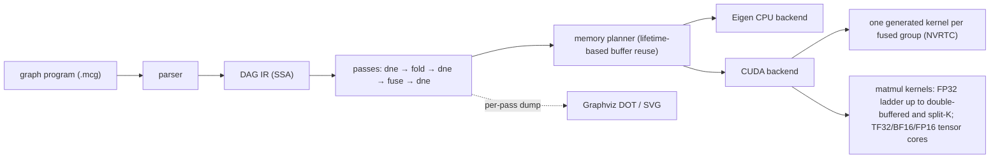
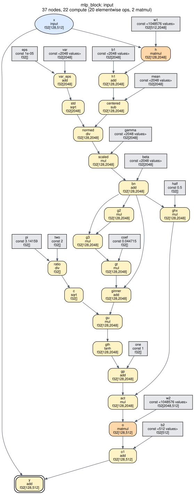
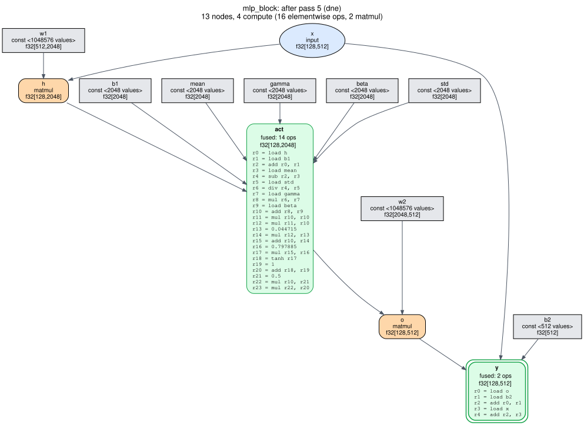
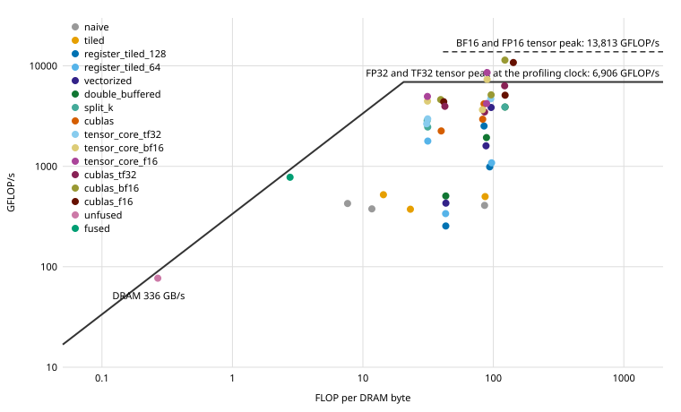

# minicompiler

[](https://github.com/kartsen03/minicompiler/actions/workflows/ci.yml)

A small compiler for ML compute graphs, written in C++17. It reads a graph
program, builds a DAG intermediate representation, optimizes it with
dead-node elimination, constant folding and elementwise operator fusion,
plans buffer reuse from value lifetimes, and executes the result on an
Eigen-based CPU backend or a CUDA backend that generates one kernel per
fused group. On the GPU, matmuls run hand-written kernels, from a naive one
up to double-buffered and split-K FP32 kernels plus opt-in TF32, BF16 and
FP16 tensor-core ones, each step measured against cuBLAS and profiled with
Nsight Compute ([results](#results-the-cuda-backend)).



## Quick start

Requires CMake 3.20+ and a C++17 compiler. Eigen and GoogleTest are taken from
the system if installed (`apt install libeigen3-dev libgtest-dev`) and
downloaded at a pinned version otherwise.

```bash
cmake -S . -B build -DCMAKE_BUILD_TYPE=Release
cmake --build build -j
ctest --test-dir build --output-on-failure
```

Compile and run a graph with the `mcc` driver:

```bash
build/tools/mcc bench/graphs/mlp_block.mcg --stats            # node counts after each pass
build/tools/mcc bench/graphs/gelu_chain.mcg --dim M=2 --print  # the optimized IR
build/tools/mcc bench/graphs/mlp_block.mcg --run               # run on seeded random inputs
build/tools/mcc bench/graphs/mlp_block.mcg --dump-dot out/     # one DOT file per stage
build/tools/mcc bench/graphs/gelu_chain.mcg --bench            # timing as JSON
```

### With the CUDA backend

If CMake finds a CUDA toolkit, the CUDA backend is built too (the configure
step says which); without one, or with `-DMINICOMPILER_ENABLE_CUDA=OFF`, the
build is CPU-only. CI builds it with CUDA 12.6 and 13.4; the results below
were measured with 13.1. The matmul kernels are compiled ahead of time for the
local GPU (`CMAKE_CUDA_ARCHITECTURES=native` by default with CMake 3.24 or
newer, otherwise sm_75 and sm_86); the elementwise and fused kernels are
generated and compiled at run time by NVRTC for whatever GPU is present.

```bash
build/tools/mcc bench/graphs/mlp_block.mcg --backend cuda --run   # run on the GPU
build/tools/mcc bench/graphs/gelu_chain.mcg --emit-cuda           # the generated CUDA source
```

To rebuild and re-measure everything on a Colab GPU, see
[Reproducing the GPU results on Colab](#reproducing-the-gpu-results-on-colab).

## How it works

**Graphs as programs.** A `.mcg` file declares inputs, constants (literal or
seeded random) and one op per line in SSA form; named dims can be overridden
from the command line. The format and its error messages are in
[`include/minicompiler/parser.hpp`](include/minicompiler/parser.hpp).

```
input x : f32[B, 512]
const w : f32[512, 2048] = uniform(seed=11, lo=-0.044, hi=0.044)
h = matmul x, w
y = relu h
output y
```

**DAG IR.** Nodes live in a vector and name their operands by index. An
operand must exist before a node can use it, so the node order is always
topological and cycles cannot be built. Passes never mutate a graph; each
builds a new one, and `Graph::verify()` re-checks every invariant (operand
order, arity, inferred types, constant sizes) after every pass.
([`graph.hpp`](include/minicompiler/graph.hpp))

**Passes** ([`include/minicompiler/passes/`](include/minicompiler/passes)):

- *Dead-node elimination*: mark and sweep from the outputs. One backward walk
  suffices because users always follow their operands.
- *Constant folding*: evaluates nodes whose operands are all constants, with
  the CPU backend's own kernels, in topological order, so whole constant
  subexpressions such as GELU's `sqrt(2/pi)` or BatchNorm's
  `sqrt(var + eps)` fold in one pass.
- *Operator fusion*: grows groups of elementwise ops from each root toward
  its producers. A producer joins when it has the root's shape, is not a
  graph output, and all of its users are already in the group. That last
  rule keeps groups convex, so fusing cannot create a cycle through an
  outside node such as a matmul. Each group becomes one `FusedElementwise`
  node holding a small per-element program, with scalar constants baked in.

**CPU backend.** Unfused ops run as vectorized Eigen expressions and matmul
uses Eigen's GEMM. A fused kernel runs its program block by block (512
elements), so intermediates stay in cache-resident 2 KB buffers instead of
making a round trip through memory for every op. Intermediate buffers are
assigned by a lifetime-based planner and reused, and graph outputs are
written straight into the caller's tensors.

**CUDA backend** ([`src/cuda/`](src/cuda)). Every elementwise op or fused
group becomes one kernel. The generator turns the group's per-element program
into CUDA C++ with the shapes baked in: broadcast index math uses constant
divisors, scalar operands are hoisted out of the loop, constants are emitted
as exact bit patterns, and the kernel uses `float4` loads and stores when
every input's layout allows it. NVRTC compiles the source straight to a cubin
for the GPU's exact architecture, a process-wide cache keeps each kernel
compiled once, and the launch is a grid-stride loop sized to one wave of
resident blocks. Matmuls run hand-written kernels, written as a ladder in
which each step is one optimization over the last, all of them kept and
selectable through `CudaOptions::matmul`
([`matmul_kernels.cu`](src/cuda/matmul_kernels.cu)):

1. naive: one thread per output, operands read from global memory;
2. tiled: 32×32 tiles of A and B staged in shared memory;
3. register-tiled: 128×128 tiles with an 8×8 block of outputs per thread in
   registers (or 64×64 with 4×4);
4. vectorized: 128-bit loads from global and shared memory, a transposed A
   tile, and a thread layout that keeps each warp's loads free of bank
   conflicts;
5. double-buffered: the next tile's loads are issued before the current
   tile's multiply-adds, so they overlap, with one barrier per tile;
6. split-K: when the output has too few tiles to fill the GPU, blocks take
   slices of K and a second kernel adds their partial products in a fixed
   order, so the result is deterministic.

The default runs the double-buffered kernel, or split-K where the output
cannot fill the GPU. Three more kernels use tensor cores
([`matmul_tensor_core.cu`](src/cuda/matmul_tensor_core.cu)): they round the
inputs to TF32, BF16 or FP16 as they stage them in shared memory and
accumulate in FP32 with WMMA. They are opt-in because the result is no longer
FP32-accurate, and the tests hold each format to its own error bound.
Device memory follows the same lifetime plan as on the CPU:
intermediates and outputs share reused buffers, inputs and constants get
their own (constants are uploaded once, at compile time), and a run copies
only the inputs in and the outputs out. `CudaExecutable::enqueue(stream)`
launches the kernels alone, on any stream, which is what the benchmarks time.

## The IR before and after optimization

The MLP block (Linear → BatchNorm → GELU → Linear + residual) goes from 37
nodes and 22 compute ops to 13 nodes and 4 compute nodes: two matmuls, a
14-op BatchNorm+GELU kernel and a 2-op bias+residual kernel.
Every stage of every benchmark graph is in [`docs/ir_diagrams/`](docs/ir_diagrams).

| Input | After all passes |
|---|---|
|  |  |

## Results: what the passes buy on the CPU

The same graphs with no passes and with the full pipeline, on the Eigen
backend, single-threaded (`bench/bench_cpu.cpp`):

<!-- BEGIN cpu-passes -->
| Graph | Size | Nodes | Compute nodes | Passes off | Passes on | Speedup (range over runs) |
|---|---|---:|---:|---:|---:|---:|
| `gelu_chain` | 1x4096 (16 KB) | 17 → 2 | 11 → 1 | 0.0065 ms | 0.0063 ms | 1.06x (1.05–1.28) |
| `gelu_chain` | 64x4096 (1 MB) | 17 → 2 | 11 → 1 | 1.10 ms | 0.469 ms | 2.34x (2.32–2.36) |
| `gelu_chain` | 256x4096 (4 MB) | 17 → 2 | 11 → 1 | 5.78 ms | 2.30 ms | 2.49x (2.45–2.54) |
| `gelu_chain` | 2048x4096 (32 MB) | 17 → 2 | 11 → 1 | 54.8 ms | 18.8 ms | 2.91x (2.88–3.35) |
| `matmul_bias_relu` | 64x1024 @ 1024x1024 | 6 → 5 | 3 → 2 | 3.55 ms | 3.56 ms | 1.00x (0.99–1.01) |
| `matmul_bias_relu` | 256x1024 @ 1024x1024 | 6 → 5 | 3 → 2 | 6.60 ms | 6.53 ms | 1.01x (1.01–1.01) |
| `mlp_block` | B=32, 512->2048->512 | 37 → 13 | 22 → 4 | 2.45 ms | 2.43 ms | 1.01x (1.01–1.01) |
| `mlp_block` | B=128, 512->2048->512 | 37 → 13 | 22 → 4 | 7.94 ms | 7.50 ms | 1.06x (1.05–1.06) |
| `mlp_block` | B=512, 512->2048->512 | 37 → 13 | 22 → 4 | 31.4 ms | 28.1 ms | 1.11x (1.10–1.11) |

Each of 3 runs times the variants in interleaved rounds; a run's speedup is the median over rounds of (passes-off time / passes-on time) within a round. The table shows the median across runs, the range across runs, and median times. Measured on CPU: 12th Gen Intel(R) Core(TM) i7-12700H, OS: Ubuntu 24.04.4 LTS, kernel 6.6.114.1-microsoft-standard-WSL2, compiler: gcc 13.3.0, Eigen 3.4.0, build: Release, march_native=ON, threads: 1 (Eigen without OpenMP), Windows power plan: Silent, commit d2c5bf6. Raw runs and the per-pass ablation: `results/cpu/`.
<!-- END cpu-passes -->

Fusion helps most when a chain of cheap elementwise ops streams tensors
larger than the caches: the unfused GELU chain spends 88% of its time in
memory-bound add/mul kernels. At 16 KB everything fits in cache, so there is
little traffic to save, and a run takes 4 µs. In the matmul-heavy graphs
Eigen's GEMM takes about 90% of the time, which caps what fusion can do.
Constant folding on its own (`dne+fold` in `results/cpu/passes.json`)
measures 0.99–1.03x: it only removes scalar arithmetic, so on the CPU its
effect is on node counts, not latency. The `dne`-only variant computes an
identical graph and stays within 0.98–1.03x for every size except the 16 KB
one (up to 1.18x), which bounds the noise. Profiles and analysis are in
[`docs/profiling/`](docs/profiling).

**Measuring on a laptop.** A pinned core's speed here drifts by up to 2x
within a minute (Windows moves the WSL virtual CPU between the i7's P- and
E-cores, and the "Silent" power plan caps power), so absolute times vary
between recordings. Every comparison is therefore timed in interleaved rounds
within one process, reported as the median of per-round ratios, and repeated
in three runs minutes apart; tables show the median across runs and the
range.

### Against PyTorch (CPU)

The same graphs, shapes, seeded weights and inputs, single-threaded on both
sides, all four variants timed interleaved in one Python process
([`bench/torch_compare.py`](bench/torch_compare.py)). minicompiler is called
in place on the NumPy arrays through a small C interface. "Eager (same ops)"
runs the graph op by op exactly as written; "eager (idiomatic)" is what a
PyTorch user would write, using PyTorch's fused library ops
(`F.gelu(approximate="tanh")`, `addmm`, `F.batch_norm`); `torch.compile` is
Inductor compiling the op-by-op function. Every PyTorch output matches
minicompiler's to within 5.4e-7 of the output's largest magnitude.

<!-- BEGIN cpu-torch -->
| Graph | Size | minicompiler | PyTorch eager (same ops) | PyTorch eager (idiomatic) | torch.compile |
|---|---|---:|---:|---:|---:|
| `gelu_chain` | 1x4096 (16 KB) | 0.015 ms | 0.063 ms, 3.99x (3.85–4.44) | 0.034 ms, 2.35x (2.19–2.49) | 0.137 ms, 8.46x (8.19–9.09) |
| `gelu_chain` | 64x4096 (1 MB) | 0.671 ms | 7.08 ms, 10.57x (10.52–10.63) | 1.86 ms, 2.73x (2.71–3.00) | 2.47 ms, 3.64x (3.61–3.83) |
| `gelu_chain` | 256x4096 (4 MB) | 2.68 ms | 28.3 ms, 10.53x (10.53–11.41) | 7.79 ms, 2.81x (2.72–2.98) | 9.04 ms, 3.29x (3.21–3.37) |
| `gelu_chain` | 2048x4096 (32 MB) | 19.2 ms | 222 ms, 11.61x (11.34–11.74) | 73.1 ms, 3.87x (3.77–3.91) | 77.7 ms, 4.05x (4.01–4.20) |
| `matmul_bias_relu` | 64x1024 @ 1024x1024 | 3.97 ms | 3.72 ms, 0.92x (0.91–0.99) | 3.63 ms, 0.90x (0.90–0.96) | 3.97 ms, 0.99x (0.98–1.05) |
| `matmul_bias_relu` | 256x1024 @ 1024x1024 | 13.6 ms | 13.2 ms, 0.98x (0.95–0.99) | 13.0 ms, 0.97x (0.94–0.97) | 13.4 ms, 0.99x (0.97–0.99) |
| `mlp_block` | B=32, 512->2048->512 | 5.07 ms | 5.69 ms, 1.19x (1.10–1.22) | 5.25 ms, 1.10x (1.02–1.14) | 5.61 ms, 1.20x (1.09–1.22) |
| `mlp_block` | B=128, 512->2048->512 | 14.3 ms | 16.1 ms, 1.12x (1.11–1.13) | 14.8 ms, 1.04x (1.01–1.04) | 14.8 ms, 1.03x (1.03–1.05) |
| `mlp_block` | B=512, 512->2048->512 | 50.9 ms | 87.4 ms, 1.68x (1.59–1.71) | 59.2 ms, 1.17x (1.06–1.17) | 55.7 ms, 1.08x (0.99–1.09) |

Ratios are PyTorch time / minicompiler time (above 1 means minicompiler is faster): within each of 3 runs, the median over interleaved rounds; shown as the median across runs with the range across runs. Measured on CPU: 12th Gen Intel(R) Core(TM) i7-12700H, PyTorch 2.14.1+cu130, Python 3.12.3, threads: 1, glibc mmap threshold: glibc default, Windows power plan: Silent, commit d2c5bf6.
<!-- END cpu-torch -->

PyTorch allocates a new output tensor on every call, and by default glibc
gives each large allocation fresh pages, so PyTorch pays page faults that
minicompiler, which reuses its buffers, does not (about 8 ms per 32 MB tensor
here). With glibc told to keep large blocks (`MALLOC_MMAP_THRESHOLD_`), that
cost disappears:

<!-- BEGIN cpu-torch-tuned -->
| Graph | Size | minicompiler | PyTorch eager (same ops) | PyTorch eager (idiomatic) | torch.compile |
|---|---|---:|---:|---:|---:|
| `gelu_chain` | 1x4096 (16 KB) | 0.011 ms | 0.043 ms, 4.07x (4.04–4.25) | 0.026 ms, 2.43x (2.32–2.51) | 0.088 ms, 8.10x (8.10–8.63) |
| `gelu_chain` | 64x4096 (1 MB) | 0.556 ms | 2.43 ms, 4.29x (3.76–4.55) | 1.63 ms, 2.88x (2.73–3.21) | 2.01 ms, 3.59x (3.41–3.64) |
| `gelu_chain` | 256x4096 (4 MB) | 2.38 ms | 10.5 ms, 4.41x (4.10–4.43) | 6.33 ms, 2.84x (2.61–2.93) | 7.23 ms, 3.24x (3.05–3.33) |
| `gelu_chain` | 2048x4096 (32 MB) | 17.2 ms | 73.1 ms, 3.98x (3.91–4.30) | 49.8 ms, 2.74x (2.50–2.84) | 54.3 ms, 3.01x (2.81–3.10) |
| `matmul_bias_relu` | 64x1024 @ 1024x1024 | 3.70 ms | 3.21 ms, 0.86x (0.86–1.04) | 3.14 ms, 0.85x (0.85–1.01) | 3.47 ms, 0.94x (0.94–1.09) |
| `matmul_bias_relu` | 256x1024 @ 1024x1024 | 12.2 ms | 11.9 ms, 0.97x (0.96–0.97) | 11.8 ms, 0.95x (0.95–0.97) | 12.1 ms, 0.98x (0.98–0.99) |
| `mlp_block` | B=32, 512->2048->512 | 4.74 ms | 4.44 ms, 0.93x (0.90–0.95) | 4.15 ms, 0.86x (0.86–0.88) | 4.51 ms, 0.94x (0.93–0.95) |
| `mlp_block` | B=128, 512->2048->512 | 14.5 ms | 16.4 ms, 1.09x (1.07–1.16) | 15.0 ms, 0.98x (0.95–1.05) | 14.5 ms, 1.02x (0.98–1.03) |
| `mlp_block` | B=512, 512->2048->512 | 52.7 ms | 61.5 ms, 1.17x (1.16–1.19) | 55.7 ms, 1.06x (1.06–1.08) | 56.1 ms, 1.09x (1.07–1.09) |

Ratios are PyTorch time / minicompiler time (above 1 means minicompiler is faster): within each of 3 runs, the median over interleaved rounds; shown as the median across runs with the range across runs. Measured on CPU: 12th Gen Intel(R) Core(TM) i7-12700H, PyTorch 2.14.1+cu130, Python 3.12.3, threads: 1, glibc mmap threshold: 4294967296, Windows power plan: Silent, commit d2c5bf6.
<!-- END cpu-torch-tuned -->

What this shows:

- **GELU chain** (1 MB and up): minicompiler is 2.73–3.87x faster than
  PyTorch's fused `F.gelu` and 3.01–4.05x faster than `torch.compile`, but
  mostly not because of fusion: those are single fused kernels too. The
  difference is largely `tanh`. Eigen's approximation is 3.9x faster than
  PyTorch's and less accurate (worst case 4.75 ulp versus 0.51 ulp,
  [`results/cpu/tanh.json`](results/cpu/tanh.json)). Against op-by-op eager,
  the 4–12x gap is fusion, allocation and `tanh` together.
- **matmul + bias + ReLU:** PyTorch wins by 1–15%. Its GEMM (oneDNN/MKL) is
  faster than Eigen's, and the GEMM is nearly all of the work.
- **MLP block:** between 0.86x and 1.20x of idiomatic PyTorch and
  `torch.compile`: ahead at batch 512 (1.06–1.17x), behind at batch 32 with
  the tuned allocator (0.86–0.94x).

## Results: the CUDA backend

Measured on an RTX 3060 Laptop GPU (30 SMs, compute capability 8.6, a
192-bit memory bus at 7001 MHz, all queried at run time) under WSL2 with the
Windows "Turbo" power plan, by
[`scripts/run_gpu_benchmarks.sh`](scripts/run_gpu_benchmarks.sh): three runs
of each benchmark, every variant timed in interleaved rounds in a shuffled
order, the tables showing the median across runs and the range. Peaks come
from the device's own properties at run time, not a spec sheet. A laptop
GPU's clock follows its power and temperature, so the tables also record the
SM clock sampled during the runs: it falls from about 1.8 GHz on the small
matmuls to 0.9 GHz on the largest, which run long enough to reach the power
limit.

### Fusion on the GPU

The GELU chain compiled without fusion (nine kernels, one per op, after
folding) and with it (one kernel), inputs already on the device
([`bench/bench_cuda.cpp`](bench/bench_cuda.cpp)):

<!-- BEGIN gpu-elementwise -->
| GELU chain size | Unfused: kernels, time, bandwidth (% of peak) | Fused: time, bandwidth (% of peak) | Fused speedup (range over runs) |
|---|---:|---:|---:|
| 1x4096 (16 KB) | 9 kernels, 0.090 ms, 4 GB/s (1%) | 0.010 ms, 3 GB/s (1%) | 5.67x (5.64–5.84) |
| 16x4096 (256 KB) | 9 kernels, 0.138 ms, 40 GB/s (12%) | 0.017 ms, 30 GB/s (9%) | 9.11x (7.31–9.17) |
| 256x4096 (4 MB) | 9 kernels, 0.369 ms, 239 GB/s (71%) | 0.039 ms, 216 GB/s (64%) | 9.42x (9.33–9.50) |
| 1024x4096 (16 MB) | 9 kernels, 1.15 ms, 306 GB/s (91%) | 0.115 ms, 293 GB/s (87%) | 10.08x (10.08–10.15) |
| 4096x4096 (64 MB) | 9 kernels, 4.52 ms, 312 GB/s (93%) | 0.435 ms, 308 GB/s (92%) | 10.37x (10.36–10.39) |
| 16384x4096 (256 MB) | 9 kernels, 18.0 ms, 313 GB/s (93%) | 1.72 ms, 311 GB/s (93%) | 10.47x (10.45–10.50) |

Times are CUDA-event medians with the input already on the device, over 3 runs (median across runs). Bandwidth counts the bytes each kernel must read and write once; peak = 2 × memory clock × bus width = 336 GB/s, from the device properties. Measured on GPU: NVIDIA GeForce RTX 3060 Laptop GPU (30 SMs, compute capability 8.6); SM clock during the runs 210–2017 MHz (median 1425); CUDA runtime 13.1, driver API 13.1; host compiler: gcc 13.3.0; Windows power plan: Turbo; commit bcf8b0a.
<!-- END gpu-elementwise -->

From 16 MB up the fused kernel is 10.1–10.5x faster, and from 64 MB up both
versions run at 92–93% of the peak bandwidth: each is as fast as DRAM allows.
The unfused chain makes 21 passes over tensors the size of the input (each op
reads its operands and writes its result), the fused kernel 2 (read `x`,
write `y`), so the speedup is the traffic fusion removes. At 16 KB and
256 KB a kernel is mostly launch overhead, and fusing nine launches into one
gives 5.7–9.1x.

### Matmul kernels against cuBLAS

Every kernel of the ladder on the same shapes, in GFLOP/s, against cuBLAS's
FP32 SGEMM:

<!-- BEGIN gpu-matmul -->
| Shape (m × k × n) | Naive | Tiled | Register 128×128 | Register 64×64 | Vectorized | Double-buffered | Split-K | cuBLAS | Default: % of cuBLAS | vs naive | % of FP32 peak | SM clock |
|---|---:|---:|---:|---:|---:|---:|---:|---:|---:|---:|---:|---:|
| 512^3 | 802 | 986 | 1,961 | 2,166 | 3,084 | 3,591 | **4,464** (3 splits) | 4,681 | 95% (93–102) | 5.62x | 32% | 1,807 MHz |
| 640^3 | 753 | 903 | 2,522 | 2,512 | 4,267 | **5,339** | (no split) | 5,128 | 104% (102–104) | 7.08x | 42% | 1,650 MHz |
| 1024^3 | 673 | 785 | 2,640 | 2,236 | 4,161 | **4,462** | (no split) | 5,858 | 75% (75–76) | 6.67x | 40% | 1,447 MHz |
| 2048^3 | 631 | 710 | 3,576 | 2,517 | 5,541 | **5,674** | (no split) | 6,081 | 93% (93–93) | 9.01x | 57% | 1,290 MHz |
| 4096^3 | 494 | 735 | 2,769 | 1,968 | 4,020 | **4,178** | (no split) | 4,610 | 88% (76–91) | 8.96x | 58% | 930 MHz |
| 1000^3 (not a tile multiple) | 662 | 721 | 2,488 | 2,125 | 3,914 | **4,295** | (no split) | 5,645 | 76% (76–76) | 6.52x | 39% | 1,417 MHz |
| 1023x1029x1031 (odd) | 648 | 723 | 2,571 | 2,189 | 3,712 | **4,077** | (no split) | 5,195 | 78% (77–78) | 6.31x | 38% | 1,387 MHz |
| 256x1024x1024 (matmul_bias_relu) | 725 | 842 | 1,675 | 1,846 | 2,819 | 3,472 | **4,900** (3 splits) | 4,681 | 105% (102–108) | 6.72x | 39% | 1,627 MHz |
| 128x512x2048 (MLP layer 1, B=128) | 760 | 883 | 1,662 | 1,873 | 2,731 | 3,502 | **4,369** (3 splits) | 3,717 | 107% (103–114) | 5.77x | 33% | 1,732 MHz |
| 128x2048x512 (MLP layer 2, B=128) | 741 | 720 | 472 | 559 | 797 | 1,032 | **5,350** (7 splits) | 3,652 | 145% (144–153) | 7.25x | 38% | 1,837 MHz |
| 512x2048x512 (MLP layer 2, B=512) | 705 | 822 | 1,644 | 1,814 | 2,781 | 3,416 | **5,147** (3 splits) | 5,699 | 89% (89–89) | 7.35x | 43% | 1,567 MHz |

GFLOP/s = 2mnk / GPU time, median across 3 runs. Each variant's launches are timed on the GPU alone, between event nodes captured with them into a CUDA graph, so the host's launch overhead, which differs between cuBLAS and these kernels, is left out for all. Bold is the backend's default: split-K where the output is too small to fill the GPU, otherwise double-buffered. In every run it was within 3% of the fastest of the other kernels for 11 of 11 shapes (split-K that does not split is the double-buffered kernel itself, so it does not count). Every kernel, cuBLAS included, is checked against a float64 reference within the FP32 error bound before timing; cuBLAS runs in plain FP32 without TF32. Peak FP32 = 2 × SMs × FP32 lanes per SM × clock: 16,128 GFLOP/s at the 2100 MHz maximum. The SM clock is the median measured during each shape's runs, and the column before it uses it: the laptop's GPU slows under the sustained load of the large shapes. Measured on GPU: NVIDIA GeForce RTX 3060 Laptop GPU (30 SMs, compute capability 8.6); SM clock during the runs 900–1980 MHz (median 1725); CUDA runtime 13.1, driver API 13.1; host compiler: gcc 13.3.0; Windows power plan: Turbo; commit bcf8b0a.
<!-- END gpu-matmul -->

Each kernel removes the bottleneck that the
[Nsight Compute profile](docs/profiling/gpu/ncu/README.md) found in the one
before it (ratios between the medians above):

- **32×32 shared-memory tiles** are only 1.09–1.23x faster than the naive
  kernel on most shapes: Ampere's L1 already catches much of the reuse the
  naive kernel misses, and the tiled kernel needs two shared-memory loads per
  multiply-add, so shared-memory issue becomes its limit.
- **Register tiling** (an 8×8 block of outputs per thread, four multiply-adds
  per shared-memory load) is 1.9–5.0x faster than the tiled kernel on every
  shape with more than 4 output tiles. Its 64×64 version, with four times the
  blocks, is 10–18% faster on the shapes with 16 or fewer 128×128 tiles,
  level at 640³ (25 tiles), and 15–30% slower on the larger ones.
- **128-bit loads** from global and shared memory, with a transposed A tile
  and a thread layout that keeps them free of bank conflicts, are 1.44–1.69x
  faster than the 128×128 register-tiled kernel on every shape: per 64
  multiply-adds a thread issues 4 shared-memory loads instead of 16.
- **Double buffering** (the next tile's loads issued before the current
  tile's multiply-adds) gains 1.02–1.04x at 2048³ and 4096³, where every SM
  holds two blocks and one block's multiply-adds already cover the other's
  loads, and 1.07–1.30x on the smaller outputs, where many SMs hold one.
- **Split-K** gives small outputs enough blocks to fill the GPU: 1.24–1.51x
  over the double-buffered kernel on the 16-tile shapes, and 5.2x on the B=128
  MLP's second layer, whose 4 output tiles otherwise leave 26 of the 30 SMs
  idle.

The default (bold) is 5.6–9.0x faster than the naive kernel. It reaches
75–104% of cuBLAS on the square and odd shapes, and 89–145% on the four
MLP-layer and `matmul_bias_relu` shapes, three of which it runs faster than
cuBLAS, most of all the B=128 layer. Its weakest shapes are 1000³, 1024³ and
the odd 1023×1029×1031 (75–78%): 64 to 72 tiles of 128×128 for the 60
blocks the GPU holds at once (two per SM), so a few blocks run as a second
wave on an otherwise idle GPU.

### Tensor cores

The three tensor-core kernels against cuBLAS on the same FP32 matrices with
the same input format, through `cublasGemmEx` with
`CUBLAS_COMPUTE_32F_FAST_TF32`, `_FAST_16BF` and `_FAST_16F` (which also round
the inputs to the format and accumulate in FP32), and both against FP32
([`bench_cuda --suite tensor_core`](bench/bench_cuda.cpp)), in TFLOP/s:

<!-- BEGIN gpu-tensor-core -->
| Shape (m × k × n) | FP32: default / cuBLAS | TF32: ours / cuBLAS (ours as % of cuBLAS) | BF16: ours / cuBLAS (ours as % of cuBLAS) | FP16: ours / cuBLAS (ours as % of cuBLAS) | SM clock |
|---|---:|---:|---:|---:|---:|
| 1024^3 | 4.9 / 6.3 | 5.7 / 6.8 (82%) | 9.0 / 11.2 (79%) | 10.4 / 11.2 (92%) | 1,575 MHz |
| 2048^3 | 5.4 / 5.7 | 6.5 / 8.7 (74%) | 10.0 / 14.9 (67%) | 11.7 / 14.7 (80%) | 1,252 MHz |
| 4096^3 | 4.0 / 4.4 | 4.9 / 6.5 (76%) | 7.6 / 12.3 (63%) | 9.0 / 12.5 (72%) | 900 MHz |
| 1000^3 (not a tile multiple) | 4.8 / 6.1 | 5.4 / 6.3 (82%) | 8.5 / 10.5 (78%) | 9.8 / 10.4 (91%) | 1,582 MHz |
| 1023x1029x1031 (odd) | 4.5 / 5.7 | 4.6 / 7.2 (64%) | 6.9 / 10.2 (68%) | 7.8 / 9.2 (85%) | 1,515 MHz |
| 256x1024x1024 (matmul_bias_relu) | 4.6 / 4.3 | 5.0 / 5.4 (92%) | 6.2 / 7.1 (82%) | 7.1 / 8.9 (80%) | 1,507 MHz |
| 128x512x2048 (MLP layer 1, B=128) | 3.2 / 2.9 | 3.5 / 4.2 (83%) | 4.5 / 6.1 (76%) | 5.0 / 5.8 (84%) | 1,740 MHz |
| 128x2048x512 (MLP layer 2, B=128) | 3.7 / 2.6 | 3.9 / 4.1 (91%) | 5.2 / 5.3 (100%) | 5.8 / 5.2 (110%) | 1,725 MHz |
| 512x2048x512 (MLP layer 2, B=512) | 5.6 / 6.1 | 6.3 / 7.9 (79%) | 7.4 / 11.0 (67%) | 8.6 / 9.9 (86%) | 1,717 MHz |

| Inputs rounded to | Unit roundoff | Largest \|c − exact\| / Σ\|ab\|, ours | cuBLAS |
|---|---:|---:|---:|
| FP32 (no rounding) | 2^-24 | 1.75e-07 | 1.53e-07 |
| TF32 | 2^-11 | 5.59e-05 | 5.59e-05 |
| BF16 | 2^-8 | 3.70e-04 | 3.70e-04 |
| FP16 | 2^-11 | 5.62e-05 | 5.62e-05 |

TFLOP/s = 2mnk / GPU time, median across 3 runs, timed as in the FP32 table; the percentage is the median over rounds of cuBLAS time / our time. Our kernels and cuBLAS get the same FP32 matrices: cuBLAS through cublasGemmEx with CUBLAS_COMPUTE_32F_FAST_TF32, _FAST_16BF or _FAST_16F, which round the inputs to the format and accumulate in FP32, as ours do. Errors are the largest over 1000 sampled elements of every shape, against a float64 dot product; every variant is also checked against its format's error bound. Measured on GPU: NVIDIA GeForce RTX 3060 Laptop GPU (30 SMs, compute capability 8.6); SM clock during the runs 900–1987 MHz (median 1597); CUDA runtime 13.1, driver API 13.1; host compiler: gcc 13.3.0; Windows power plan: Turbo; commit bcf8b0a.
<!-- END gpu-tensor-core -->

What it shows:

- **Each format costs the accuracy its unit roundoff predicts, in these
  kernels and in cuBLAS alike.** The largest error relative to Σ|ab| is the
  same in both for every format: 5.6e-5 for TF32 and FP16 (u = 2⁻¹¹), 3.7e-4
  for BF16 (u = 2⁻⁸), against 1.5–1.8e-7 for FP32: about 300 and 2,000 times
  FP32's error, which is why these kernels are opt-in.
- **On this GPU TF32 buys little.** Nsight Compute reports a TF32 tensor
  peak of 256 FLOP per SM per clock here, the same as the FP32 units' 128
  lanes × 2, so TF32 can only win on efficiency: our TF32 kernel is
  1.02–1.21x faster than the FP32 default, cuBLAS's 1.15–1.62x. FP16 and BF16
  with FP32 accumulation peak at 512, twice FP32: our FP16 kernel is
  1.53–2.22x faster than the FP32 default (2.15–2.22x from 1024³ to 4096³),
  cuBLAS's 1.50–3.10x.
- **Ours runs at 63–110% of cuBLAS in the same format**: FP16 72–110%, BF16
  63–100%, TF32 64–92%. On the B=128 layer, where it splits K seven ways, it
  is ahead with FP16 and level with BF16. At 2048³ Nsight Compute shows our
  FP16 kernel's tensor pipe at 62% of its peak and cuBLAS's CUTLASS kernel's
  at 78%, both with 8 warps per SM: cuBLAS stages FP32 tiles through a
  three-stage pipeline and converts them after the shared-memory load, which
  WMMA's opaque fragment layout rules out (see
  [What I'd do next](#what-id-do-next)).

### Against PyTorch on the same GPU

The same graphs, seeded weights and inputs as the CPU comparison, plus larger
sizes, all variants in one process on one CUDA stream
([`bench/torch_compare.py --device cuda`](bench/torch_compare.py)). "torch.compile,
CUDA graphs" is `mode="reduce-overhead"`. Every PyTorch output matches
minicompiler's to within 1.7e-6 of the output's largest magnitude.

<!-- BEGIN gpu-torch -->
| Graph | Size | minicompiler | PyTorch eager (same ops) | PyTorch eager (idiomatic) | torch.compile | torch.compile, CUDA graphs | SM clock |
|---|---|---:|---:|---:|---:|---:|---:|
| `gelu_chain` | 1x4096 (16 KB) | 0.041 ms | 0.249 ms, 7.16x (6.84–7.20) | 0.053 ms, 1.47x (1.46–1.54) | 0.193 ms, 4.34x (4.04–4.86) | 0.278 ms, 6.13x (5.73–7.26) | 382 MHz |
| `gelu_chain` | 256x4096 (4 MB) | 0.048 ms | 0.435 ms, 9.33x (7.64–9.46) | 0.071 ms, 1.25x (1.16–1.31) | 0.184 ms, 3.24x (3.10–3.49) | 0.283 ms, 5.16x (4.71–5.62) | 1140 MHz |
| `gelu_chain` | 2048x4096 (32 MB) | 0.223 ms | 2.32 ms, 10.35x (10.31–10.37) | 0.243 ms, 1.03x (1.03–1.06) | 0.347 ms, 1.53x (1.49–1.57) | 0.626 ms, 2.75x (2.72–2.80) | 1740 MHz |
| `gelu_chain` | 8192x4096 (128 MB) | 0.864 ms | 8.96 ms, 10.33x (10.29–10.39) | 0.874 ms, 1.00x (0.99–1.00) | 1.01 ms, 1.15x (1.15–1.19) | 1.94 ms, 2.23x (2.21–2.27) | 1492 MHz |
| `matmul_bias_relu` | 256x1024 @ 1024x1024 | 0.169 ms | 0.200 ms, 1.21x (1.21–1.23) | 0.173 ms, 1.06x (1.05–1.08) | 0.288 ms, 1.83x (1.80–1.98) | 0.357 ms, 2.29x (2.26–2.48) | 1170 MHz |
| `matmul_bias_relu` | 2048x1024 @ 1024x1024 | 0.907 ms | 0.858 ms, 0.93x (0.93–0.95) | 0.831 ms, 0.91x (0.89–0.92) | 0.929 ms, 1.01x (0.99–1.04) | 1.06 ms, 1.15x (1.12–1.19) | 1320 MHz |
| `mlp_block` | B=128, 512->2048->512 | 0.194 ms | 0.535 ms, 3.17x (2.82–3.33) | 0.316 ms, 1.86x (1.65–1.91) | 0.380 ms, 2.04x (1.89–2.12) | 0.463 ms, 2.55x (2.41–2.59) | 1117 MHz |
| `mlp_block` | B=512, 512->2048->512 | 0.487 ms | 0.906 ms, 1.85x (1.81–1.85) | 0.477 ms, 0.97x (0.96–0.97) | 0.550 ms, 1.12x (1.12–1.13) | 0.661 ms, 1.33x (1.33–1.36) | 1537 MHz |
| `mlp_block` | B=4096, 512->2048->512 | 5.00 ms | 7.42 ms, 1.49x (1.48–1.49) | 4.46 ms, 0.89x (0.89–0.89) | 4.40 ms, 0.88x (0.88–0.89) | 4.60 ms, 0.93x (0.92–0.93) | 900 MHz |

Ratios are PyTorch time / minicompiler time (above 1 means minicompiler is faster): within each of 3 runs, the median over interleaved rounds; shown as the median across runs with the range. All variants run in one process on one CUDA stream with their inputs on the device; each call is timed with CUDA events from before the call to the end of its last kernel, so host launch overhead counts. The timer's own floor (a call that launches nothing) was 5–7 µs. The SM clock column is the median sampled during each config: a laptop GPU stays near idle clocks when the calls are tiny. Measured on GPU: NVIDIA GeForce RTX 3060 Laptop GPU (30 SMs, compute capability 8.6); SM clock during the runs 210–1995 MHz (median 1372); CUDA runtime 13.0, driver API 13.1; PyTorch 2.14.1+cu130; PyTorch's CUDA 13.0; Triton 3.8.0; Windows power plan: Turbo; commit bcf8b0a.
<!-- END gpu-torch -->

What this shows:

- **Elementwise graphs:** one generated kernel per fused group puts
  minicompiler level with PyTorch's own hand-written fused `F.gelu` from
  32 MB up (1.00–1.03x) and about 10x ahead of running the graph op by op.
  From 16 KB to 4 MB it is 1.25–1.47x ahead of `F.gelu`: one ctypes call
  into C++ that launches one kernel costs less host time than PyTorch's
  dispatch. `torch.compile` is 1.15–4.34x behind, and its kernel is not the
  reason (see the profiles below).
- **Matmul-heavy graphs:** on the B=128 MLP block minicompiler is 1.86x
  faster than idiomatic PyTorch and 2.04x faster than `torch.compile`,
  because its split-K kernel runs the long-K second layer faster than cuBLAS
  does. On the larger MLP blocks and the larger matmul + bias + ReLU,
  idiomatic PyTorch is 3–12% faster (0.89–0.97x), the margin cuBLAS keeps over
  the default kernel on large matmuls; on the smaller matmul + bias + ReLU
  minicompiler is 1.06x ahead.
- **CUDA graphs** don't help these one-call latencies: `reduce-overhead`
  copies every input into the graph's own buffer before replaying, which
  costs as much as a bandwidth-bound kernel.

### Where the time goes

[Nsight Systems profiles](docs/profiling/gpu) of the same calls separate
host time from kernel time:

- At 32 MB, minicompiler's GELU kernel, PyTorch's `F.gelu` kernel and
  Inductor's Triton kernel each take 211–213 µs, the time to stream 64 MB
  through DRAM. A `torch.compile` call takes 363 µs against minicompiler's
  279 µs: the gap is host-side overhead in the compiled function, not code
  generation.
- In the B=512 MLP block, minicompiler's matmuls take 178 µs each on average
  where cuBLAS takes 140–148 µs per layer. Its two fused elementwise kernels
  (34 µs) are close to Inductor's two (30 µs) and far ahead of eager's 20
  (about 450 µs).
- At B=128 minicompiler splits both layers, 3 and 7 ways: its matmuls take
  48 µs each plus 11 µs of partial sums, against cuBLAS's 65–69 µs per layer.

[Nsight Compute counters](docs/profiling/gpu/ncu) for one launch of each
kernel (with the GPU held at its 900 MHz base clock) back the explanations
above with measurements:

- The unfused GELU chain moves 21.0 times its input through DRAM and the
  fused kernel 2.0 times, both at 90–92% of the DRAM's peak throughput.
- Up the FP32 ladder at 2048³ the FMA pipe is busy 8% of the time
  (shared-memory tiles, stalled on shared-memory issue), 40% (register
  tiling), 59% (128-bit loads) and 61% (double buffering), against cuBLAS's
  64% at the same occupancy. No FP32 kernel has a shared-memory bank
  conflict.
- On the 128×2048×512 layer, split-K's 28 blocks take 94 µs where the unsplit
  kernel's 4 take 530 µs and cuBLAS's `ampere_sgemm_64x32_sliced1x4` 119 µs.
- At 2048³ the tensor-core kernels keep their tensor pipe 53–68% busy and
  cuBLAS's CUTLASS kernels 78–92%, at the same or lower occupancy.



Nsight Compute held the SM at 900 MHz, so that chart's roofs are the peaks
at that clock: 6,906 GFLOP/s for FP32 and TF32, 13,813 GFLOP/s for FP16 and
BF16 with FP32 accumulation.

## Reproducing the GPU results on Colab

[`notebooks/gpu_validation.ipynb`](notebooks/gpu_validation.ipynb)
([open in Colab](https://colab.research.google.com/github/kartsen03/minicompiler/blob/main/notebooks/gpu_validation.ipynb))
clones the repository at a pinned commit, builds it with the CUDA backend for
the Colab GPU's compute capability, runs every test and fails if any GPU test
is skipped, runs the four GPU benchmarks three times, writes
`results/gpu/*.json` with the commit, GPU and CUDA versions, and shows the
same tables as this README. Choose a T4 runtime, then Run all. A T4 (compute
capability 7.5) has FP16 tensor cores but not TF32 or BF16 ones, so its
tensor-core table has FP16 only.

## Testing

GoogleTest suites ([`tests/`](tests)) cover each component and each pass's
behavior, compare every kernel against a double-precision reference with
stated tolerances, and check on random graphs that optimized and unoptimized
graphs agree. The random-graph generator tracks interval bounds so it only
builds numerically meaningful graphs. There are 86 test cases in 20 suites
without the CUDA backend and 103 in 21 with it; CTest also runs the example
program.

With the CUDA backend, more tests compare the GPU with the CPU backend: every
unary and binary op (bit for bit where IEEE arithmetic requires it, within
8 ulp for the transcendental functions), every broadcast pattern, the
benchmark graphs fused and unfused, and 200 random graphs. Every FP32 matmul
kernel runs on 14 shapes that straddle the tile sizes and the K step, within
the dot-product error bound; split-K and the tensor-core kernels also run at
forced split counts (more splits than K has tiles, a short last split) with
the output prefilled with NaN, so an unwritten element fails; and each
tensor-core format is held to its own bound. The GPU tests skip when no GPU is
present, and so do the formats a GPU lacks; a tensor-core kernel that cannot
run on the GPU, or that the build compiled only for older architectures, must
fail at compile time rather than run without its body.

CI builds and tests on Ubuntu with GCC, Clang, and GCC under AddressSanitizer
and UndefinedBehaviorSanitizer, and builds the CUDA backend with CUDA 12.6
and 13.4 in NVIDIA's containers. Those runners have no GPU, so there the GPU
tests skip and everything else runs.

## What I'd do next

- **A CUTLASS-style tensor-core main loop.** cuBLAS's kernel stages FP32
  tiles in shared memory through a three-stage `cp.async` pipeline (its 72 KB
  of shared memory is exactly three 256×16 plus 16×128 FP32 tiles), converts
  them in registers after the fragment load, and gives each warp a 64×64 tile.
  WMMA hides the fragment layout, so the conversion has to happen before
  shared memory, and a 64×64 warp tile with WMMA spilled registers here.
  `mma.sync` and `ldmatrix`, with their documented layouts, allow both.
- **Fuse epilogues into the matmul.** In the MLP block, bias, BatchNorm and
  GELU follow a matmul as a separate fused kernel that reads the matmul's
  output back from DRAM; applying them before the matmul kernel stores its
  tile would remove that round trip.
- **CUDA graphs** for small graphs, where launch overhead dominates: capture
  the launch sequence once and replay it. The benchmarks already time
  matmuls this way; the backend does not run graphs yet.
- **Autotuning instead of fixed rules.** The split-K rule (split when the
  tiles cover less than 80% of the SMs, by how many blocks an SM holds) was
  calibrated on one GPU; timing the candidates for each shape at compile time
  would not need calibrating.
- **Reductions** (softmax, LayerNorm) and fusion across them, which is where
  graph compilers find most of their gains on transformer blocks.

## Layout

```
include/minicompiler/   public headers: IR, parser, passes, DOT export, runtime, CUDA backend
src/                    implementation; src/cpu/ is the Eigen backend, src/cuda/ the CUDA one
tools/mcc.cpp           command-line driver
tests/                  GoogleTest suites
bench/                  benchmark graphs (.mcg), CPU and GPU benchmarks, PyTorch harness
scripts/                diagram rendering, profiling, benchmark recording, result tables
notebooks/              Colab notebook that rebuilds and re-measures the GPU results
docs/                   IR diagrams, profiling results, claims audit
results/                recorded benchmark results (JSON), raw runs included
```

## License

MIT. See [LICENSE](LICENSE).
