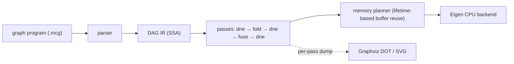

# minicompiler

[](https://github.com/kartsen03/minicompiler/actions/workflows/ci.yml)

A small compiler for ML compute graphs, written in C++17. It reads a graph
program, builds a DAG intermediate representation, optimizes it with
dead-node elimination, constant folding and elementwise operator fusion,
plans buffer reuse from value lifetimes, and executes the result on an
Eigen-based CPU backend.



## Quick start

Requires CMake 3.20+ and a C++17 compiler. Eigen and GoogleTest are taken from
the system if installed (`apt install libeigen3-dev libgtest-dev`) and
downloaded at a pinned version otherwise.

```bash
cmake -S . -B build -DCMAKE_BUILD_TYPE=Release
cmake --build build -j
ctest --test-dir build --output-on-failure
```

Compile and run a graph with the `mcc` driver:

```bash
build/tools/mcc bench/graphs/mlp_block.mcg --stats            # node counts after each pass
build/tools/mcc bench/graphs/gelu_chain.mcg --dim M=2 --print  # the optimized IR
build/tools/mcc bench/graphs/mlp_block.mcg --run               # run on seeded random inputs
build/tools/mcc bench/graphs/mlp_block.mcg --dump-dot out/     # one DOT file per stage
build/tools/mcc bench/graphs/gelu_chain.mcg --bench            # timing as JSON
```

## How it works

**Graphs as programs.** A `.mcg` file declares inputs, constants (literal or
seeded random) and one op per line in SSA form; named dims can be overridden
from the command line. The format and its error messages are in
[`include/minicompiler/parser.hpp`](include/minicompiler/parser.hpp).

```
input x : f32[B, 512]
const w : f32[512, 2048] = uniform(seed=11, lo=-0.044, hi=0.044)
h = matmul x, w
y = relu h
output y
```

**DAG IR.** Nodes live in a vector and name their operands by index. An
operand must exist before a node can use it, so the node order is always
topological and cycles cannot be built. Passes never mutate a graph; each
builds a new one, and `Graph::verify()` re-checks every invariant (operand
order, arity, inferred types, constant sizes) after every pass.
([`graph.hpp`](include/minicompiler/graph.hpp))

**Passes** ([`include/minicompiler/passes/`](include/minicompiler/passes)):

- *Dead-node elimination*: mark and sweep from the outputs. One backward walk
  suffices because users always follow their operands.
- *Constant folding*: evaluates nodes whose operands are all constants, with
  the CPU backend's own kernels, in topological order, so whole constant
  subexpressions such as GELU's `sqrt(2/pi)` or BatchNorm's
  `sqrt(var + eps)` fold in one pass.
- *Operator fusion*: grows groups of elementwise ops from each root toward
  its producers. A producer joins when it has the root's shape, is not a
  graph output, and all of its users are already in the group. That last
  rule keeps groups convex, so fusing cannot create a cycle through an
  outside node such as a matmul. Each group becomes one `FusedElementwise`
  node holding a small per-element program, with scalar constants baked in.

**CPU backend.** Unfused ops run as vectorized Eigen expressions and matmul
uses Eigen's GEMM. A fused kernel runs its program block by block (512
elements), so intermediates stay in cache-resident 2 KB buffers instead of
making a round trip through memory for every op. Intermediate buffers are
assigned by a lifetime-based planner and reused, and graph outputs are
written straight into the caller's tensors.

## The IR before and after optimization

The MLP block (Linear → BatchNorm → GELU → Linear + residual) goes from 37
nodes and 22 compute ops to 13 nodes and 4 compute nodes: two matmuls, a
14-op BatchNorm+GELU kernel and a 2-op bias+residual kernel.
Every stage of every benchmark graph is in [`docs/ir_diagrams/`](docs/ir_diagrams).

| Input | After all passes |
|---|---|
|  |  |

## Results: what the passes buy on the CPU

The same graphs with no passes and with the full pipeline, on the Eigen
backend, single-threaded (`bench/bench_cpu.cpp`):

<!-- BEGIN cpu-passes -->
| Graph | Size | Nodes | Compute nodes | Passes off | Passes on | Speedup (range over runs) |
|---|---|---:|---:|---:|---:|---:|
| `gelu_chain` | 1x4096 (16 KB) | 17 → 2 | 11 → 1 | 0.0065 ms | 0.0063 ms | 1.06x (1.05–1.28) |
| `gelu_chain` | 64x4096 (1 MB) | 17 → 2 | 11 → 1 | 1.10 ms | 0.469 ms | 2.34x (2.32–2.36) |
| `gelu_chain` | 256x4096 (4 MB) | 17 → 2 | 11 → 1 | 5.78 ms | 2.30 ms | 2.49x (2.45–2.54) |
| `gelu_chain` | 2048x4096 (32 MB) | 17 → 2 | 11 → 1 | 54.8 ms | 18.8 ms | 2.91x (2.88–3.35) |
| `matmul_bias_relu` | 64x1024 @ 1024x1024 | 6 → 5 | 3 → 2 | 3.55 ms | 3.56 ms | 1.00x (0.99–1.01) |
| `matmul_bias_relu` | 256x1024 @ 1024x1024 | 6 → 5 | 3 → 2 | 6.60 ms | 6.53 ms | 1.01x (1.01–1.01) |
| `mlp_block` | B=32, 512->2048->512 | 37 → 13 | 22 → 4 | 2.45 ms | 2.43 ms | 1.01x (1.01–1.01) |
| `mlp_block` | B=128, 512->2048->512 | 37 → 13 | 22 → 4 | 7.94 ms | 7.50 ms | 1.06x (1.05–1.06) |
| `mlp_block` | B=512, 512->2048->512 | 37 → 13 | 22 → 4 | 31.4 ms | 28.1 ms | 1.11x (1.10–1.11) |

Each of 3 runs times the variants in interleaved rounds; a run's speedup is the median over rounds of (passes-off time / passes-on time) within a round. The table shows the median across runs, the range across runs, and median times. Measured on CPU: 12th Gen Intel(R) Core(TM) i7-12700H, OS: Ubuntu 24.04.4 LTS, kernel 6.6.114.1-microsoft-standard-WSL2, compiler: gcc 13.3.0, Eigen 3.4.0, build: Release, march_native=ON, threads: 1 (Eigen without OpenMP), Windows power plan: Silent, commit d2c5bf6. Raw runs and the per-pass ablation: `results/cpu/`.
<!-- END cpu-passes -->

Fusion helps most when a chain of cheap elementwise ops streams tensors
larger than the caches: the unfused GELU chain spends 88% of its time in
memory-bound add/mul kernels. At 16 KB everything fits in cache, so there is
little traffic to save, and a run takes 4 µs. In the matmul-heavy graphs
Eigen's GEMM takes about 90% of the time, which caps what fusion can do.
Constant folding on its own (`dne+fold` in `results/cpu/passes.json`)
measures 0.99–1.03x: it only removes scalar arithmetic, so on the CPU its
effect is on node counts, not latency. The `dne`-only variant computes an
identical graph and stays within 0.98–1.03x for every size except the 16 KB
one (up to 1.18x), which bounds the noise. Profiles and analysis are in
[`docs/profiling/`](docs/profiling).

**Measuring on a laptop.** A pinned core's speed here drifts by up to 2x
within a minute (Windows moves the WSL virtual CPU between the i7's P- and
E-cores, and the "Silent" power plan caps power), so absolute times vary
between recordings. Every comparison is therefore timed in interleaved rounds
within one process, reported as the median of per-round ratios, and repeated
in three runs minutes apart; tables show the median across runs and the
range.

### Against PyTorch (CPU)

The same graphs, shapes, seeded weights and inputs, single-threaded on both
sides, all four variants timed interleaved in one Python process
([`bench/torch_compare.py`](bench/torch_compare.py)). minicompiler is called
in place on the NumPy arrays through a small C interface. "Eager (same ops)"
runs the graph op by op exactly as written; "eager (idiomatic)" is what a
PyTorch user would write, using PyTorch's fused library ops
(`F.gelu(approximate="tanh")`, `addmm`, `F.batch_norm`); `torch.compile` is
Inductor compiling the op-by-op function. Every PyTorch output matches
minicompiler's to within 5.4e-7 of the output's largest magnitude.

<!-- BEGIN cpu-torch -->
| Graph | Size | minicompiler | PyTorch eager (same ops) | PyTorch eager (idiomatic) | torch.compile |
|---|---|---:|---:|---:|---:|
| `gelu_chain` | 1x4096 (16 KB) | 0.015 ms | 0.063 ms, 3.99x (3.85–4.44) | 0.034 ms, 2.35x (2.19–2.49) | 0.137 ms, 8.46x (8.19–9.09) |
| `gelu_chain` | 64x4096 (1 MB) | 0.671 ms | 7.08 ms, 10.57x (10.52–10.63) | 1.86 ms, 2.73x (2.71–3.00) | 2.47 ms, 3.64x (3.61–3.83) |
| `gelu_chain` | 256x4096 (4 MB) | 2.68 ms | 28.3 ms, 10.53x (10.53–11.41) | 7.79 ms, 2.81x (2.72–2.98) | 9.04 ms, 3.29x (3.21–3.37) |
| `gelu_chain` | 2048x4096 (32 MB) | 19.2 ms | 222 ms, 11.61x (11.34–11.74) | 73.1 ms, 3.87x (3.77–3.91) | 77.7 ms, 4.05x (4.01–4.20) |
| `matmul_bias_relu` | 64x1024 @ 1024x1024 | 3.97 ms | 3.72 ms, 0.92x (0.91–0.99) | 3.63 ms, 0.90x (0.90–0.96) | 3.97 ms, 0.99x (0.98–1.05) |
| `matmul_bias_relu` | 256x1024 @ 1024x1024 | 13.6 ms | 13.2 ms, 0.98x (0.95–0.99) | 13.0 ms, 0.97x (0.94–0.97) | 13.4 ms, 0.99x (0.97–0.99) |
| `mlp_block` | B=32, 512->2048->512 | 5.07 ms | 5.69 ms, 1.19x (1.10–1.22) | 5.25 ms, 1.10x (1.02–1.14) | 5.61 ms, 1.20x (1.09–1.22) |
| `mlp_block` | B=128, 512->2048->512 | 14.3 ms | 16.1 ms, 1.12x (1.11–1.13) | 14.8 ms, 1.04x (1.01–1.04) | 14.8 ms, 1.03x (1.03–1.05) |
| `mlp_block` | B=512, 512->2048->512 | 50.9 ms | 87.4 ms, 1.68x (1.59–1.71) | 59.2 ms, 1.17x (1.06–1.17) | 55.7 ms, 1.08x (0.99–1.09) |

Ratios are PyTorch time / minicompiler time (above 1 means minicompiler is faster): within each of 3 runs, the median over interleaved rounds; shown as the median across runs with the range across runs. Measured on CPU: 12th Gen Intel(R) Core(TM) i7-12700H, PyTorch 2.14.1+cu130, Python 3.12.3, threads: 1, glibc mmap threshold: glibc default, Windows power plan: Silent, commit d2c5bf6.
<!-- END cpu-torch -->

PyTorch allocates a new output tensor on every call, and by default glibc
gives each large allocation fresh pages, so PyTorch pays page faults that
minicompiler, which reuses its buffers, does not (about 8 ms per 32 MB tensor
here). With glibc told to keep large blocks (`MALLOC_MMAP_THRESHOLD_`), that
cost disappears:

<!-- BEGIN cpu-torch-tuned -->
| Graph | Size | minicompiler | PyTorch eager (same ops) | PyTorch eager (idiomatic) | torch.compile |
|---|---|---:|---:|---:|---:|
| `gelu_chain` | 1x4096 (16 KB) | 0.011 ms | 0.043 ms, 4.07x (4.04–4.25) | 0.026 ms, 2.43x (2.32–2.51) | 0.088 ms, 8.10x (8.10–8.63) |
| `gelu_chain` | 64x4096 (1 MB) | 0.556 ms | 2.43 ms, 4.29x (3.76–4.55) | 1.63 ms, 2.88x (2.73–3.21) | 2.01 ms, 3.59x (3.41–3.64) |
| `gelu_chain` | 256x4096 (4 MB) | 2.38 ms | 10.5 ms, 4.41x (4.10–4.43) | 6.33 ms, 2.84x (2.61–2.93) | 7.23 ms, 3.24x (3.05–3.33) |
| `gelu_chain` | 2048x4096 (32 MB) | 17.2 ms | 73.1 ms, 3.98x (3.91–4.30) | 49.8 ms, 2.74x (2.50–2.84) | 54.3 ms, 3.01x (2.81–3.10) |
| `matmul_bias_relu` | 64x1024 @ 1024x1024 | 3.70 ms | 3.21 ms, 0.86x (0.86–1.04) | 3.14 ms, 0.85x (0.85–1.01) | 3.47 ms, 0.94x (0.94–1.09) |
| `matmul_bias_relu` | 256x1024 @ 1024x1024 | 12.2 ms | 11.9 ms, 0.97x (0.96–0.97) | 11.8 ms, 0.95x (0.95–0.97) | 12.1 ms, 0.98x (0.98–0.99) |
| `mlp_block` | B=32, 512->2048->512 | 4.74 ms | 4.44 ms, 0.93x (0.90–0.95) | 4.15 ms, 0.86x (0.86–0.88) | 4.51 ms, 0.94x (0.93–0.95) |
| `mlp_block` | B=128, 512->2048->512 | 14.5 ms | 16.4 ms, 1.09x (1.07–1.16) | 15.0 ms, 0.98x (0.95–1.05) | 14.5 ms, 1.02x (0.98–1.03) |
| `mlp_block` | B=512, 512->2048->512 | 52.7 ms | 61.5 ms, 1.17x (1.16–1.19) | 55.7 ms, 1.06x (1.06–1.08) | 56.1 ms, 1.09x (1.07–1.09) |

Ratios are PyTorch time / minicompiler time (above 1 means minicompiler is faster): within each of 3 runs, the median over interleaved rounds; shown as the median across runs with the range across runs. Measured on CPU: 12th Gen Intel(R) Core(TM) i7-12700H, PyTorch 2.14.1+cu130, Python 3.12.3, threads: 1, glibc mmap threshold: 4294967296, Windows power plan: Silent, commit d2c5bf6.
<!-- END cpu-torch-tuned -->

What this shows:

- **GELU chain** (1 MB and up): minicompiler is 2.73–3.87x faster than
  PyTorch's fused `F.gelu` and 3.01–4.05x faster than `torch.compile`, but
  mostly not because of fusion: those are single fused kernels too. The
  difference is largely `tanh`. Eigen's approximation is 3.9x faster than
  PyTorch's and less accurate (worst case 4.75 ulp versus 0.51 ulp,
  [`results/cpu/tanh.json`](results/cpu/tanh.json)). Against op-by-op eager,
  the 4–12x gap is fusion, allocation and `tanh` together.
- **matmul + bias + ReLU:** PyTorch wins by 1–15%. Its GEMM (oneDNN/MKL) is
  faster than Eigen's, and the GEMM is nearly all of the work.
- **MLP block:** between 0.86x and 1.20x of idiomatic PyTorch and
  `torch.compile`: ahead at batch 512 (1.06–1.17x), behind at batch 32 with
  the tuned allocator (0.86–0.94x).

## Testing

GoogleTest suites ([`tests/`](tests)) cover each component and each pass's
behavior, compare every kernel against a double-precision reference with
stated tolerances, and check on random graphs that optimized and unoptimized
graphs agree. The random-graph generator tracks interval bounds so it only
builds numerically meaningful graphs. CI builds and tests on Ubuntu with GCC,
Clang, and GCC under AddressSanitizer and UndefinedBehaviorSanitizer.

## Layout

```
include/minicompiler/   public headers: IR, parser, passes, DOT export, runtime
src/                    implementation; src/cpu/ is the Eigen backend
tools/mcc.cpp           command-line driver
tests/                  GoogleTest suites
bench/                  benchmark graphs (.mcg), CPU benchmark, PyTorch harness
scripts/                diagram rendering, profiling, benchmark recording
docs/                   IR diagrams and profiling results
results/                recorded benchmark results (JSON)
```

## License

MIT. See [LICENSE](LICENSE).
